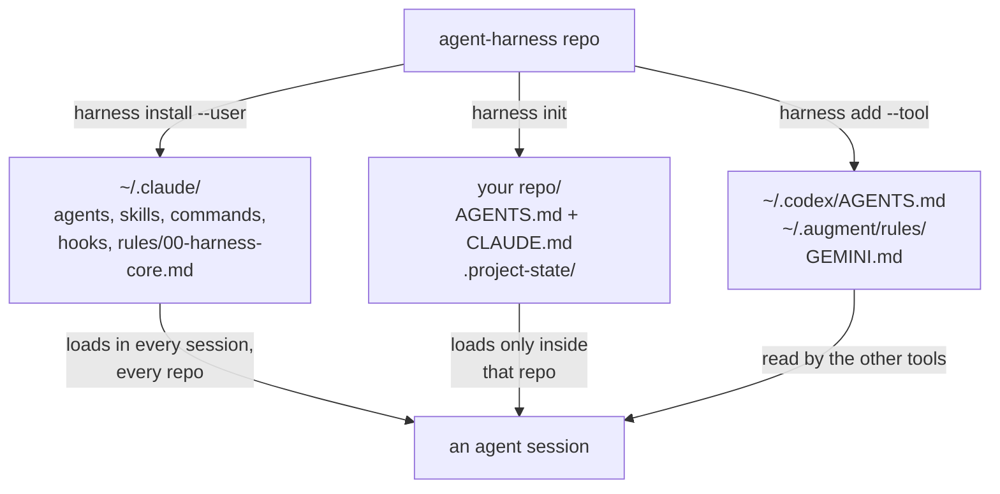

# agent-harness

A portable operating framework for AI coding agents: instructions, subagent definitions, skills,
slash commands, and safety hooks. One command installs the always-on core onto a new machine, and
one more sets up a repository.

One instruction set is read by Claude Code, Auggie, Intent, Codex, Cursor, Gemini CLI, Copilot and
Windsurf, because they converged on `AGENTS.md` and `CLAUDE.md`. Be clear on what that does and
does not mean: the instruction layer is genuinely shared, while agents, skills and hooks are
Claude Code mechanisms that other tools support partially or not at all. Augment's COSMOS takes a
different shape again: its Experts are committable YAML bundles applied with `auggie cloud`.
`adapters/README.md` states exactly what each tool consumes, including the gaps.

Most agent setups accumulate as a pile of machine-specific config that cannot leave the laptop it
grew on. This one is built to be moved, shared, and forked.

## Install

```bash
git clone <this-repo> ~/projects/agent-harness
cd ~/projects/agent-harness
./bin/harness install --user     # the always-on core, into ~/.claude
./bin/harness verify             # confirm nothing personal or machine-specific came along
```

Put `bin/` on your `PATH`, then in any repository you want the project layer in:

```bash
harness init                     # AGENTS.md, CLAUDE.md, .project-state/
harness add workspace-brain      # state machine, autonomy gates, artifact persistence
harness add --tool auggie        # another tool's pointer file
```

Everything is additive. Nothing is overwritten without `--force`, and every skip is reported. Run
anything with `--dry-run` first to see what it would touch.

Requires `bash`, `git`, `jq`, and `perl`. A missing one stops the install with a message naming it,
rather than leaving a half-installed tree. On a locked-down machine where you cannot install `jq`,
everything except the `settings.json` merge still works; do that step by hand.

## What you get

Ten subagent definitions, each named for the job it does rather than the model it runs on, so a
roster change does not turn every filename into a lie:

| Agent | Tier | For |
|---|---|---|
| `exec-mechanical` | SMALL | Fully specified edits a test already proves. |
| `exec-standard` | MID | Bounded work against a pattern already in the repo. |
| `exec-critical` | FRONTIER-DO | Correctness-critical implementation. |
| `exec-subtle` | FRONTIER-DO | The single subtlest workstream in a plan. |
| `adversary` | FRONTIER-DO | Tries to break a diff before it merges. |
| `design-reviewer` | FRONTIER-THINK | Judges a plan against the code that actually exists. |
| `plan-synthesizer` | FRONTIER-THINK | Turns scattered investigation into one execution plan. |
| `autorun-plan-orchestrator` | FRONTIER-DO | Drives an approved multi-wave plan unattended. |
| `data-eng-sa-orchestrator` | MID | Builds data and analytics deliverables. |
| `data-eng-sa-reviewer` | FRONTIER-DO | Reviews them for grain and metric correctness. |

Twelve skills, invocable as `/<name>`: `autorun-plan`, `brainstorming`, `deep-plan-swarm`,
`external-llm-review`, `heartbeat`, `readme-coauthoring`, `repo-recon`, `requesting-code-review`,
`scope-audit`, `systematic-debugging`, `test-driven-development`, `verify-unexecuted`.

Four slash commands: `/deep-plan`, `/handoff`, `/next-step`, `/phase-status`.

## How the two scopes fit together



User scope is how you work, everywhere. Project scope is how one repository works. The workspace
brain is project scope on purpose: it mandates writing `active/` artifact directories, and you do
not want those appearing inside every repo you touch.

## What is in it

| Directory | What it holds |
|---|---|
| `AGENTS.md` | The canonical instruction set. Self-contained, vendor-neutral, read by every tool. |
| `CLAUDE.md` | A one-line import of `AGENTS.md` plus Claude Code specifics. |
| `agents/` | 10 subagent definitions, named for the job they do rather than the model they run. |
| `skills/` | 12 invocable skills: planning, autonomous execution, review, debugging, TDD, scoping. |
| `commands/` | Slash commands for planning, handoff, and phase status. |
| `hooks/` | A `PreToolUse` gate that refuses any subagent spawn with no explicit model. |
| `rules/` | Path-scoped rules that load only when relevant. |
| `templates/` | Project scaffolding, the workspace brain, and the nested-phase pattern. |
| `config/models.conf` | The single place tiers bind to real models. |
| `verify.sh` | The scrub gate. Ten checks, fails the build rather than leaking. |

## Two ideas worth knowing before you use it

**Size the model from the task, not from convenience.** Work is sorted into four tiers by two
questions: what a silent wrong answer costs, and whether the result is mechanically checkable.

| Tier | For |
|---|---|
| `SMALL` | Extraction, classification, mechanical grind a test can prove. |
| `MID` | Implementation against a pattern already in the repo, wiring, tests, prose. |
| `FRONTIER-DO` | Correctness-critical logic and adversarial review. Is this right, and will it hold? |
| `FRONTIER-THINK` | Root-causing an unexplained failure, greenfield design, synthesis. What is really going on here? |

The two frontier tiers differ by disposition, not strength. Tiers are named by capability rather
than by model, so a new release slots in by description instead of by a rename across every file.
`config/models.conf` binds them to real models and is the only file to edit when a machine has
different access. Reviewers always sit at or above the tier that produced the work, because a
reviewer cheaper than the builder cannot see the builder's mistakes.

`harness install` reads that file and writes the real model name into each agent definition, so the
repo stays tier-named and only the installed copy carries a vendor model name.

**Context is the scarce resource, and imports do not save any of it.** An imported file loads at
launch exactly like inline text. What actually reduces per-session context is path-scoped rules,
skills that load only when invoked, and giving each phase of a large build its own short
`CLAUDE.md` in its own directory. The always-on core is deliberately small. `docs/` covers this in
depth.

## Portability

`AGENTS.md` is the canonical file because it is the format the ecosystem standardized on, and
`CLAUDE.md` imports it rather than symlinking it, since symlinks need Administrator rights on
Windows and check out as plain text when `core.symlinks` is false.

Auggie reads `CLAUDE.md` natively and at higher precedence than `AGENTS.md`. Intent reads both plus
a `skills/` directory. Codex, Cursor, Gemini CLI, Copilot, and Windsurf read `AGENTS.md`. COSMOS
Experts are YAML bundles you can commit and apply with `auggie cloud`, alongside a conversational
Advisor path that is fileless. `adapters/README.md` has the details per tool.

## The scrub gate

`verify.sh` exists because this framework is meant to be carried onto machines that are not yours.
It fails on absolute home paths, vendor model names that escaped into prose, agent definitions
missing a tier pin, malformed skill frontmatter, permission-bypass defaults, shell scripts with a
fragile shebang, banned typographic glyphs in client-facing docs, and any term in a personal-marker
denylist.

That denylist deliberately lives outside the repository, at `~/.agent-harness-denylist` or wherever
`--denylist` points, because a committed list of the things you want to keep private is itself the
leak.

A scrub that has never been run against a known-bad input is unverified, so the gate is tested by
planting each defect class into a scratch copy and confirming a non-zero exit.

## Documentation

New to agentic coding? Read them in this order.

| Document | What it covers |
|---|---|
| [Getting started](docs/getting-started.md) | A guided first hour: install, scopes, your first real task. |
| [Choosing the right mechanism](docs/choosing-your-tools.md) | Instructions, rules, skills, commands, hooks, subagents, and which to reach for. |
| [Managing the context window](docs/context-window-management.md) | Why long sessions degrade, and the levers that actually help. |
| [Sizing the model to the task](docs/model-tiering.md) | The four tiers, and why reviewers sit at or above the builder. |
| [Handing off between sessions](docs/handoff-and-resume.md) | Writing a resume prompt that survives a context clear. |
| [Planning and executing a large build](docs/planning-large-builds.md) | Scoping, phases, and machine-checkable acceptance. |
| [Autonomous execution](docs/autorun-hitl-heartbeat.md) | AUTORUN, HEARTBEAT, and reducing interruptions without losing safety. |
| [Tracking work across sessions](docs/project-management.md) | Project state on disk, and what the fork adds. |

## Third-party content

Four skills are vendored from the Superpowers collection. See `skills/THIRD_PARTY.md` for
provenance and for the license check to complete before distributing this repository publicly.

## License

Not yet chosen. Treat as all rights reserved until a license file is added.
