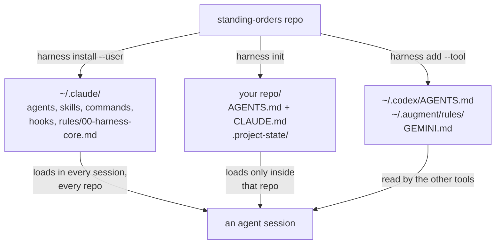

# standing-orders

Instructions that stay in force across every session, every tool, and every machine.

An AI coding agent (Claude Code, Codex, Cursor, and similar tools) reads instruction files out of
your project and its own config directory before it does anything. This repository is a shared,
version-controlled set of those instruction files, so the rules an agent follows do not live only
in one person's head or one machine's settings.

A portable operating framework for AI coding agents: instructions, subagent definitions, skills,
slash commands, and safety hooks. One command installs the always-on core onto a new machine, and
one more sets up a repository.

One instruction set is read by Claude Code, Auggie, Intent, Codex, Cursor, Gemini CLI, Copilot and
Windsurf, because they converged on `AGENTS.md` and `CLAUDE.md`. The instruction layer is shared;
skills, commands and hooks are supported by some of those tools and not others. Augment goes
furthest. Auggie reads this repo's skills and commands with no conversion at all, takes the
security hard stops as tool-permission rules, and needs only its subagent definitions generated;
`harness add --tool auggie` does that. Augment's COSMOS takes a different shape again: its Experts
are committable YAML bundles applied with `auggie cloud`. Every Augment claim in this repository
comes from the vendor's documentation as of 2026-09-16 and none of it has been run against a live
Auggie yet. `adapters/README.md` states what each tool consumes and marks each claim;
[`docs/augment-runbook.md`](docs/augment-runbook.md) is the procedure that turns those claims into verified ones.

Most agent setups accumulate as a pile of machine-specific config that cannot leave the laptop it
grew on. This one is built to be moved, shared, and forked.

## Contents

- [Install](#install)
- [What you get](#what-you-get)
- [How the two scopes fit together](#how-the-two-scopes-fit-together)
- [What is in it](#what-is-in-it)
- [Two ideas worth knowing before you use it](#two-ideas-worth-knowing-before-you-use-it)
- [Portability](#portability)
- [The scrub gate](#the-scrub-gate)
- [Documentation](#documentation)
- [Third-party content](#third-party-content)
- [License](#license)

## Install

```bash
git clone <this-repo> ~/projects/standing-orders
cd ~/projects/standing-orders
./bin/harness upstream           # clone the repos in config/upstream.conf into .upstream/
./bin/harness install --user     # the always-on core, into ~/.claude
./bin/harness verify             # confirm nothing personal or machine-specific came along
```

Clone before install, in that order. `install` deploys the upstream skills that
`config/upstream.conf` marks with `install=`, and it can only deploy what is already on disk.

`harness upstream` clones the other projects this harness references rather than copying them in,
so they stay current and stay the author's.

An entry marked `install=` in that file is then deployed by `install`, and that is running
third-party code this repository's gate does not scan. The gate prints the count every run, and
[`docs/operating-boundaries.md`](docs/operating-boundaries.md) explains the trade and how to switch it off. Entries with no
`install=` are reference material only: point your coding tool at `.upstream/` and it reads the
source and installs what it needs in its own format. See [`docs/upstream-sources.md`](docs/upstream-sources.md).

**On Windows**, run all of this in Git Bash or WSL 2, not PowerShell. [`docs/windows.md`](docs/windows.md) covers the
setup and one thing you should read before relying on the model-pin gate there.

Put `bin/` on your `PATH`, then in any repository you want the project layer in:

```bash
harness init                     # AGENTS.md, CLAUDE.md, .project-state/
harness add workspace-brain      # state machine, autonomy gates, artifact persistence
harness add --tool auggie        # another tool's config: see adapters/README.md
```

Almost everything is additive, with one exception worth knowing before the first run. Files the
installer OWNS at user scope, meaning the agents, skills, commands, hooks and core rules it
deployed, are replaced when they differ, with the previous copy kept under
`~/.claude/backups/`. That is what makes a rebind take one line instead of a manual sweep. Your own
files, and anything at project scope, are never touched without `--force`, and every skip is
reported. Run
anything with `--dry-run` first to see what it would touch.

Requires `bash`, `git`, `jq`, and `perl`. A missing one stops the install with a message naming it,
rather than leaving a half-installed tree. `jq` is one of those prerequisites: the installer needs
it to merge `settings.json` without clobbering what is already there, so `harness install` stops if
it is missing rather than installing most of the tree and failing at the last step.

## What you get

Eleven subagent definitions, each named for the job it does rather than the model it runs on, so a
roster change does not turn every filename into a lie:

| Agent | Tier | For |
|---|---|---|
| `exec-mechanical` | SMALL | Fully specified edits a test already proves. |
| `exec-standard` | MID | Bounded work against a pattern already in the repo. |
| `exec-critical` | FRONTIER-DO | Correctness-critical implementation. |
| `exec-subtle` | FRONTIER-DO | The single subtlest workstream in a plan. |
| `adversary` | FRONTIER-DO | Tries to break a diff before it merges. |
| `design-reviewer` | FRONTIER-THINK | Judges a plan against the code that actually exists. |
| `plan-synthesizer` | FRONTIER-THINK | Turns scattered investigation into one execution plan. |
| `autorun-plan-orchestrator` | FRONTIER-DO | Drives an approved multi-wave plan unattended. |
| `data-eng-sa-orchestrator` | MID | Builds data and analytics deliverables. |
| `data-eng-sa-reviewer` | FRONTIER-DO | Reviews them for grain and metric correctness. |
| `code-reviewer` | FRONTIER-DO | Reviews a diff against its plan for production readiness. |

Thirteen skills, invocable as `/<name>`: `autorun-plan`, `brainstorming`, `deep-plan-swarm`,
`external-llm-review`, `grill-me`, `heartbeat`, `readme-coauthoring`, `repo-recon`, `requesting-code-review`,
`scope-audit`, `systematic-debugging`, `test-driven-development`, `verify-unexecuted`.

Four slash commands: `/deep-plan`, `/handoff`, `/next-step`, `/phase-status`.

## How the two scopes fit together



User scope is how you work, everywhere. Project scope is how one repository works. The workspace
brain is project scope on purpose: it mandates writing `active/` artifact directories, and you do
not want those appearing inside every repo you touch.

## What is in it

| Directory | What it holds |
|---|---|
| `AGENTS.md` | The canonical instruction set. Self-contained, vendor-neutral, read by every tool. |
| `CLAUDE.md` | A one-line import of `AGENTS.md` plus Claude Code specifics. |
| `agents/` | 11 subagent definitions, named for the job they do rather than the model they run. |
| `skills/` | 13 invocable skills: planning, autonomous execution, review, debugging, TDD, scoping. |
| `commands/` | Slash commands for planning, handoff, and phase status. |
| `hooks/` | A `PreToolUse` gate that denies a subagent spawn with no model pin, plus the status-line script. |
| `rules/` | Path-scoped rules that load only when relevant. |
| `templates/` | Project scaffolding, the workspace brain, and the nested-phase pattern. |
| `config/models.conf` | The single place tiers bind to real models. |
| `verify.sh` | The scrub gate. Fourteen checks, fails the build rather than leaking. |

## Two ideas worth knowing before you use it

**Size the model from the task, not from convenience.** Work is sorted into four tiers by two
questions: what a silent wrong answer costs, and whether the result is mechanically checkable.

| Tier | For |
|---|---|
| `SMALL` | Extraction, classification, mechanical grind a test can prove. |
| `MID` | Implementation against a pattern already in the repo, wiring, tests, prose. |
| `FRONTIER-DO` | Correctness-critical logic and adversarial review. Is this right, and will it hold? |
| `FRONTIER-THINK` | Root-causing an unexplained failure, greenfield design, synthesis. What is really going on here? |

The two frontier tiers differ by disposition, not strength. Tiers are named by capability rather
than by model, so a new release slots in by description instead of by a rename across every file.
`config/models.conf` binds them to real models and is the only file to edit when a machine has
different access. Reviewers always sit at or above the tier that produced the work, because a
reviewer cheaper than the builder cannot see the builder's mistakes.

`harness install` reads that file and writes the real model name into each agent definition, so the
repo stays tier-named and only the installed copy carries a vendor model name.

**Context is the scarce resource, and imports do not save any of it.** An imported file loads at
launch exactly like inline text. What actually reduces per-session context is path-scoped rules,
skills that load only when invoked, and giving each phase of a large build its own short
`CLAUDE.md` in its own directory. The always-on core is deliberately small. `docs/` covers this in
depth.

## Portability

`AGENTS.md` is the canonical file because it is the format the ecosystem standardized on, and
`CLAUDE.md` imports it rather than symlinking it, since symlinks need Administrator rights on
Windows and check out as plain text when `core.symlinks` is false.

Auggie reads `CLAUDE.md` natively and at higher precedence than `AGENTS.md`, and it also reads
`.claude/skills/` and `.claude/commands/` straight out of the repo. Its subagents use a different
frontmatter schema, so those are generated: `harness add --tool auggie` writes `.augment/agents/`
and the tool-permission rules, and `harness build-plugin --tool auggie` packages the lot as an
installable plugin. Intent reads `AGENTS.md` and `CLAUDE.md` plus a `skills/` directory. Codex,
Cursor, Gemini CLI, Copilot, and Windsurf read `AGENTS.md`. COSMOS Experts are YAML bundles you can
commit and apply with `auggie cloud`, alongside a conversational Advisor path that is fileless.
`adapters/README.md` has the details per tool, and [`docs/augment-runbook.md`](docs/augment-runbook.md) is the procedure for
standing the Augment side up on a machine that has Auggie.

## The scrub gate

`verify.sh` exists because this framework is meant to be carried onto machines that are not yours.
It fails on absolute home paths, vendor model names that escaped into prose, agent definitions
missing a tier pin, malformed skill frontmatter, permission-bypass defaults, shell scripts with a
fragile shebang, and banned typographic glyphs in client-facing docs. The leak checks read both what
is on disk and what is in the git index, because those are two different sets of bytes: one reaches
your machine and the other reaches whoever clones.

A scrub that has never been run against a known-bad input is unverified, so the gate is tested by
planting each defect class into a scratch copy and confirming a non-zero exit.

## Documentation

New to agentic coding? The table runs newcomer to specialist, but you do not need every row at
once; the groups below say when each one matters:

- **Day one:** [Orientation](docs/orientation.md), [Glossary](docs/glossary.md),
  [Getting started](docs/getting-started.md),
  [Choosing the right mechanism](docs/choosing-your-tools.md),
  [Your first day](docs/first-day.md).
- **Your first week:** [Operating process](docs/operating-process.md),
  [Worked scenarios](docs/scenarios.md), the two context documents
  ([managing](docs/context-window-management.md) and [watching](docs/context-health.md)),
  [Sizing the model to the task](docs/model-tiering.md),
  [Handing off between sessions](docs/handoff-and-resume.md).
- **When you need it:** everything else. Reach for a row when its "who it is for" describes you
  today.
- **If you are reviewing this harness rather than using it:**
  [Operating boundaries](docs/operating-boundaries.md), then [Reference](docs/reference.md).

| Document | Who it is for |
|---|---|
| [Orientation](docs/orientation.md) | Anyone who has never used an AI coding agent before; defines the vocabulary everything else assumes. |
| [Glossary](docs/glossary.md) | Anyone who hits an unfamiliar term and wants the one place it is defined. |
| [Getting started](docs/getting-started.md) | A new user installing the harness for the first time. |
| [Choosing the right mechanism](docs/choosing-your-tools.md) | Anyone unsure whether they need an instruction, a rule, a skill, a command, a hook, or a subagent. |
| [Your first day](docs/first-day.md) | A new user who wants the first real session done for real, with actual output. |
| [Running on Windows](docs/windows.md) | Anyone on Windows, and anyone who needs to know the model-pin gate is not reliably enforced there. |
| [Windows gate investigation](docs/windows-gate-investigation.md) | Whoever takes on closing the Windows enforcement gap; a paste-ready brief for researching the fix. |
| [Troubleshooting](docs/troubleshooting.md) | Anyone looking at a symptom right now who wants the one page that fixes it. |
| [Operating process](docs/operating-process.md) | A user running their first real task after the first-day tour. |
| [Managing the context window](docs/context-window-management.md) | Anyone whose sessions degrade over time and wants to know why. |
| [Watching the context window](docs/context-health.md) | Anyone who wants the status line, and what the published research does and does not support. |
| [Context in Augment](docs/augment-context.md) | Anyone moving between Claude Code and Auggie, where the context model is different. |
| [Standing up the Augment side](docs/augment-runbook.md) | Whoever has a machine with Auggie on it and has to turn the documentation claims into verified ones. |
| [Reading a corpus too big for one agent](docs/corpus-swarms.md) | Anyone facing more files than one session can hold, who needs the grouped-swarm shape and the honest limits on it. |
| [Sizing the model to the task](docs/model-tiering.md) | Anyone dispatching subagents or writing plans that name a tier. |
| [Writing your own extensions](docs/writing-your-own.md) | Someone authoring a new agent, skill, rule, command, or hook. |
| [Handing off between sessions](docs/handoff-and-resume.md) | Anyone closing a session that another session must resume. |
| [Anti-patterns](docs/anti-patterns.md) | Anyone who wants to learn from failures this repo already recorded. |
| [Operating boundaries](docs/operating-boundaries.md) | A security reviewer or an engineer's employer asking what this harness actually does. |
| [Getting more than one answer](docs/deliberation.md) | Anyone facing a contested design decision, a go/no-go, or a research synthesis where one model's first answer is not enough. |
| [Worked scenarios](docs/scenarios.md) | Anyone who wants to see five real-shaped projects run start to finish, including one where the harness deliberately stays out of the way. |
| [The full lifecycle](docs/lifecycle.md) | Anyone who wants the whole path, idea to deploy, on one page before diving into any single stage. |
| [Planning and executing a large build](docs/planning-large-builds.md) | Someone scoping a multi-day or multi-phase change. |
| [Autonomous execution](docs/autorun-hitl-heartbeat.md) | Someone running an unattended, multi-hour build. |
| [Finishing a build](docs/finishing-a-build.md) | Anyone closing out a build and wondering what the harness covers for review, QA, red team and deploy, and what it does not. |
| [Tracking work across sessions](docs/project-management.md) | A team keeping project state on disk across sessions and tools. |
| [Building a private knowledge vault](docs/knowledge-vault.md) | A team that wants agents to maintain a corpus over time without letting them corrupt it or leak it. |
| [Upstream sources](docs/upstream-sources.md) | Anyone wondering why another project's skills are cloned next to this repo rather than copied into it. |
| [Reference](docs/reference.md) | Anyone who wants the generated, authoritative list of every agent, skill, command, and config key. |

## Third-party content

The `brainstorming`, `requesting-code-review`, `systematic-debugging` and
`test-driven-development` skills are vendored from the Superpowers collection. See
`skills/THIRD_PARTY.md` for
provenance and for the license check to complete before distributing this repository publicly.

## License

Not yet chosen. Treat as all rights reserved until a license file is added.
