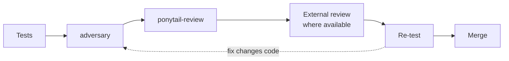

# Autonomous execution: AUTORUN, HITL reduction, and HEARTBEAT

## Before you read this

This document assumes you already know three things `docs/glossary.md` defines:
[`advisor`](glossary.md#advisor), the host's built-in
[`Plan` subagent](glossary.md#the-host-built-in-subagent-types-plan-explore-general-purpose), and
[the Workflow tool](glossary.md#the-workflow-tool). If your tool has no Workflow equivalent, the
answer to "Workflow or subagents" below is always subagents.

This article also describes an optional external second-opinion review step. That step requires
one of several third-party CLIs (`skills/external-llm-review/SKILL.md:15` names codex,
cursor-agent, and gemini) installed and authenticated on your machine. If you do not have one of
those set up, that step does not apply to you, and the gate is the rest of the stack: the test
command, the `adversary` agent, `/ponytail-review`, re-running the tests, and merging. Do not treat the
external review step as required; it is a strengthening step, not a floor.

A six-hour build cannot have a human watching every step, and an agent that goes wrong early in an
unsupervised run can waste the entire six hours before anyone notices. Those two facts are in
tension, and this article is about the mechanisms the harness uses to resolve it: which one to use,
what each actually does, and what it explicitly does not do. Choosing wrong here is expensive in
wall-clock hours, so this is written to be precise rather than brief.

## The problem in one sentence

Unattended execution needs to keep going without a human in the loop for routine decisions, while
still catching a wrong decision before it compounds into hours of wasted work on a bad foundation.
Two mechanisms in this harness solve that trade-off differently, and picking the wrong one either
burns context reviewing a plan that never needed it, or lets an unreviewed build run unattended
past the point where a mistake was still cheap to catch.

## AUTORUN: the full harness

The `autorun-plan` skill (executed by the `autorun-plan-orchestrator` agent) is the heavy mechanism.
It exists for approved multi-wave plans meant to run overnight or otherwise unattended for a long
stretch, and it assumes the plan already baked its gates in during synthesis (see
`planning-large-builds.md` for how `deep-plan-swarm` and `plan-synthesizer` do that).

### The per-wave review gate stack

Every code-producing wave passes through the same ordered stack before it merges:

| Step | What runs | What it catches |
|---|---|---|
| 1 | The test command the plan names, green | Basic correctness the wave claims to have |
| 2 | `adversary` review of the merged wave diff | Fail-open paths, bypasses, tamper vectors, defect classes the tests did not exercise |
| 3 | `/ponytail-review` on the wave diff | Reuse, over-engineering, wrong altitude: quality only, never a bug hunt, never a substitute for step 2 |
| 4 | External-LLM fold-back loop on the final simplified diff | Shared blind spots a same-family reviewer cannot see |
| 4.5 | Re-run the test command plus phase-specific tests, after the last step-3/4 fix | Regressions introduced by the review fixes themselves |
| 5 | Merge | - |

The order is load-bearing, not incidental. Step 3 runs after step 2 because there is no point
simplifying code that the correctness review is about to rewrite anyway. Step 4 runs on the final
simplified diff, so the external reviewer sees what will actually ship rather than an intermediate
draft. Step 4.5 exists because steps 3 and 4 both apply fixes, and any fix that changes code
re-enters the review at step 2 rather than skipping straight to merge; a fix is a code change, and
an unreviewed code change is exactly what the earlier steps exist to prevent.

Two of these steps deserve their own explanation, because they are easy to mistake for each other.
`adversary` is a Claude reviewer at the top model tier, run at maximum effort, and it tries
specifically to break the change: it sweeps a fixed taxonomy first (fail-open, fail-stuck,
global-versus-local scope mismatches, vacuous assertions, fixtures that pin both sides of a
contract so they cannot disagree) and then hunts freely. It is read-only and never edits. The
external-LLM step, covered by the `external-llm-review` skill, is a different model family
entirely (`codex`, `cursor-agent`, or `gemini`, whichever the plan names) attacking the same
diff. The skill states outright that a Claude reviewer, however strong, is never a substitute for
this step, because shared model-family blind spots are exactly what step 4 is meant to catch and a
same-family reviewer structurally cannot.

The fold-back loop in step 4 has no round cap. It stops when a round returns no new CRITICAL or
HIGH finding, and the skill's stopping rule sharpens this further: it counts findings by class, not
by instance, so a new instance of an already-known defect class resets the loop and requires a
closure artifact for that class, rather than being waved through as "already reported." A numeric
round cap is explicitly forbidden, because it would let review stop on a schedule instead of on
convergence.

### AUTORUN-STATE, parking, and continuing

Every run under this skill maintains a state file, `.project-state/AUTORUN-STATE-<mission-slug>.md`,
scoped to the specific mission by name. The skill is emphatic that this file is mission-scoped and
never a shared singleton: because `.project-state/` is tracked and shared across worktrees, an
unslugged state file would let a fresh run silently overwrite a different workstream's durable
record, and a state file that describes a different mission is treated as foreign and never read,
reconciled against, or overwritten.

On every wake, the orchestrator reads its own state file, then reconciles it against the actual
world (`git status`, `git log`, the plan's test command, any locks or sentinels the mission names)
rather than trusting what the file says happened. State gets rewritten after every meaningful
step, so a crash or an unexpected context clear costs at most one step of progress, not the whole
run.

Parking is the harness's answer to a stream that hits a real blocker or a genuine human gate: that
one branch stops and holds unmerged, with the reason recorded, while every other independent stream
keeps running. The skill states this as a first-class outcome, not a failure: "parking is success;
guessing is failure." A single blocked workstream is never allowed to idle an entire overnight run,
and the close-out report lists every parked branch with its reason and a pointer to the diff, so a
human reviewing in the morning can pick each one up without re-deriving what stopped it.

### Auto-proceed-on-rule

This is the mechanism that actually reduces human-in-the-loop interruptions, and it has a strict
definition. A human stop exists only if one of four conditions holds: (a) the pass/fail rule cannot
be stated in advance because it needs live judgment; (b) the action reaches a real person outside
the system; (c) the action is irreversible and has no tested rollback; or (d) it requires physical
human action, like a UI click or a desktop paste. Everything else auto-proceeds: the rule gets
stated in the plan up front, the run proceeds while the rule holds, and it parks the branch loudly
the moment the rule stops holding.

| Action | Gate? | Which rule | Example |
|---|---|---|---|
| Mechanical refactor across many files | No | rule (a) does not apply; pass/fail is statable | Renaming a function and its call sites |
| Merge a green wave | No | rule (a) does not apply; the test command is the rule | A wave whose named tests pass |
| Send that reaches a person outside the system | Always | never weakens | An email, a Slack message, a PR comment |
| Deletion of tracked content | Always | never weakens | `git rm` on a tracked file |
| Write to a source of truth the plan marks read-only | Always | never weakens | Writing to an upstream config the plan only reads |
| Live-data mutation with a tested rollback | No, with the corollary | rule (c); needs a branch, patch, snapshot, and tested rollback first | A reversible database write staged behind a snapshot |
| Production change | Hard stop | `AGENTS.md` security list | Deploying to external hosting |
| UI click or desktop paste | Yes | rule (d) | Approving a dialog no API exposes |

The skill calls a "does this look right?" gate a defect in the plan, not a safety feature, because
if the rule can be written down, a human clicking approve on it is providing no information the
rule did not already provide. The three "never weakens" rows above hold regardless of how cleanly
the pass/fail rule reads, because the cost of being wrong there is categorically different from
being wrong about, say, which files a mechanical refactor touches.

## HEARTBEAT: deliberately much lighter

The `heartbeat` skill exists for the opposite case: a plan that has already been reviewed and
approved, where the `autorun-plan` gate stack would cost more context than it protects. Its own
description states this directly: it is for keeping an already-approved plan executing until it
finishes or hits a real human gate, and it does this with no review gates, no adversarial pass, no
external-LLM loop, and no improvement rounds.

The skill is explicit, in its own words, about what it does not do: no adversary pass, no
`/ponytail-review`, no external-LLM review or fold-back, no plan-quality judgment. The plan is
already approved, so heartbeat's job is to execute it, not to re-litigate whether it is a good
plan. Its state file is also named differently on purpose,
`.project-state/HEARTBEAT-STATE-<mission-slug>.md` rather than an `AUTORUN-STATE-*` file,
specifically so that a future reader of the state file can tell which harness ran just from the
filename, without opening it. A `HEARTBEAT-STATE` file lying around means nobody should assume the
full gate stack executed on that run.

The honest trade-off here is real and worth stating plainly. The full AUTORUN gate stack (tests,
adversarial review, simplification, an external-LLM fold-back loop with no round cap, re-tests
after every fix) is expensive. It costs context, it costs wall-clock time, and it is worth that
cost exactly when the thing being reviewed is complex, high-stakes, or produced by a process (like
an unreviewed synthesis step) that has not already been checked. For a plan that is simple enough
and has already passed review, running that entire stack again on every wave is pure overhead: it
spends real context re-checking work that was already checked, on a plan simple enough that the
extra checking was never going to find anything the original approval missed.

## Deciding which one to use

| Question | AUTORUN | HEARTBEAT |
|---|---|---|
| Has the plan already been reviewed and approved? | Either | Yes, required |
| Is the work correctness-critical, high-stakes, or does a silent wrong answer cost a lot? | Yes | No |
| Is the plan simple enough that another full review pass would find nothing new? | No | Yes |
| Does the plan itself bake in a per-wave gate stack? | Yes, and AUTORUN executes it | No such stack exists |

The deciding question, stated plainly: **would the full gate stack, run again on this specific
plan, actually catch something the approval process has not already caught?** If the honest answer
is yes, use `autorun-plan`. If the honest answer is no because the plan is simple and already
vetted, use `heartbeat`, and do not run both: the `heartbeat` skill says so directly, because
running both means paying the AUTORUN cost while pretending you are running the cheap path.

## HITL reduction done responsibly

The goal of reducing human-in-the-loop interruptions is fewer interruptions, not fewer safety
checks. Those are different goals, and it is possible to satisfy the first while quietly failing
the second if the auto-proceed rule is written too loosely. The harness's answer is to make the
line explicit rather than leave it to judgment in the moment.

An agent may decide for itself, without asking, wherever the pass/fail rule can be stated in
advance, the action is reversible or has a tested rollback, and the action stays inside the
machine (nothing that reaches a real person outside the system). That
covers most of the routine decisions a build makes: which mechanical fix to apply, whether a test
suite is green, whether a wave's diff passed its review stack, whether to continue to the next
phase of an approved plan.

An agent must always stop for a human at the boundaries `AGENTS.md` states as hard stops, and
`autorun-plan` treats these as the short, genuinely run-ending exception list rather than something
a well-argued rule can talk its way around:

- modifying production systems or databases
- deleting or migrating data
- changing authentication, authorization, billing, or secrets
- deploying to external hosting
- using any permission-bypass flag
- legal, compliance, or financial workflows
- any irreversible action with external cost or impact

Everything else, including things that look risky at first glance, gets a stated rule and
auto-proceeds under it. The distinction the harness draws is not "risky versus safe," it is
"statable-and-reversible versus not." A mechanical refactor across fifty files is not inherently
low-risk, but if the rule for correctness is stated and checkable, it does not need a human to
approve each file. A single write to a production database is inherently high-risk regardless of
how confident the rule sounds, because it is on the hard-stop list by category, not by a case-by-case
risk assessment.

## The autonomous build loop

`templates/project/knowledge/autonomous-build-loop.md` describes a related but distinct pattern:
not how to keep an approved plan running unattended, but how a single session should decompose and
execute the next increment of a build with minimal operator interruption, deciding its own next
step from structured results rather than asking after every step.

The loop's stages, in order: orient (read the plan and project state, identify the next increment
and reconcile what is already done); call the advisor to pressure-test the decomposition before
building anything; decompose (write the frozen integration contract for this increment inline -
file layout, schemas, the pinned interfaces between the units about to be built in parallel,
because parallelizing before this contract exists guarantees the units will invent incompatible
schemas or paths); fan out parallel sub-agents on disjoint work units, each writing its own
artifacts and a verbatim report to disk; integrate and verify by assembling from disk and running
the machine-checkable acceptance suite; run an adversarial review that tries to refute the result
against the design's stated invariants, fixing every blocking finding and proving the fix by
reproducing the original attack as a regression test; decide the next step from the structured
results; and persist the contract, run, and verification artifacts plus any generalizable rule that
emerged.

The organizing principle underneath all of this is that decisions bubble up to exactly one
orchestrator, and that orchestrator decides the next step itself from what its sub-agents returned.
The document states this as a standing rule: do not prompt the operator for anything the
orchestrator can resolve from the plan, the repo, and the results already in hand. A human gets
pulled in at two kinds of moment only: a genuine Level-C hard stop, or a Level-B fork where two
readings of the situation would lead to materially different outcomes and nothing in the available
context resolves which one is right. Every other decision, including most of what a less disciplined
process would stop and ask about, gets made by the orchestrator and reported after the fact rather
than asked about beforehand.

## When autonomy goes wrong

Three failure modes recur across long autonomous runs, and each one has a specific mechanism in
this harness built to catch it.

**A wrong early decision compounds.** The `autorun-plan` skill documents a real case where an
operator disabled a component mid-run, the orchestrator noted the change in its state file, and
then spent hours continuing to harden a control whose only purpose was managing that now-disabled
component. The skill's rule for this is to treat any premise change (a component disabled, a
spike returning a verdict, a dependency dropped) as a forced stop-and-reconsider: what work does
this make unnecessary, what downstream requirements just lost their justification, and does the
work in flight right now still earn its place. Noting a premise change in a log and continuing
anyway is exactly the mistake this rule exists to prevent; sunk cost on an open branch is not a
reason to finish it.

**A gate passes because its own check is silent.** A verification is only as good as its ability to
actually fail when something is wrong, and a check whose success path produces no distinguishable
signal from its failure-to-even-run path cannot tell the two apart. This is the same failure the
harness's phase templates guard against by requiring "done when" to be a script that asserts and
exits non-zero, rather than a description a model can satisfy by several different real states,
some of them wrong. It also shows up in review tooling specifically: the `external-llm-review`
skill lists concrete traps that produce a fake-clean verdict, including a `timeout` wrapper on
macOS silently failing and leaving a nearly empty output file that looks the same as a terse but
real review if only its size is checked, and a reviewer stuck in a reconnect loop that keeps
growing its output file while never producing a verdict. The skill's rule is to check for the
`VERDICT:` marker and its findings block, never file size alone, and to treat anything that skips
that marker as a failed round rather than a silent pass.

**An agent reports success it did not verify.** The harness's standing rule, stated in
`autorun-plan`'s own improvements list, is that a subagent's "tests pass" is a claim, and the
orchestrator re-runs the check itself before trusting it. This is the same logic behind requiring
machine-checkable acceptance everywhere else: a model's self-report about its own work is not
independent evidence of that work, because the same failure that produced a wrong result could just
as easily produce a wrong report about that result. The fix is structural rather than a matter of
asking more carefully: re-run the check from a tree that can actually resolve it, on the suite's own
real command rather than a nearby equivalent, and in the main checkout rather than a worktree that
might be missing gitignored fixtures the real environment has. The `autorun-plan` skill documents a
case where five consecutive rounds were green inside a worktree, and the first full run on the main
checkout after merging failed two tests outright, because one test walked directories the worktree
never had in the first place. No amount of worktree-green output could have caught that; only
running the real command in the real tree could.
