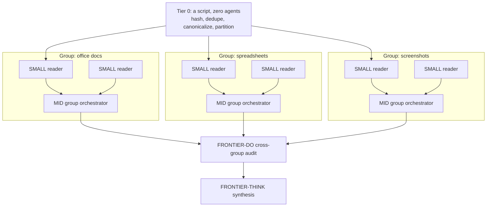

# Reading a corpus too big for one agent

A single agent can hold maybe a few hundred kilobytes of source text in its context before
compression starts eating the detail you needed. Some corpora blow past that by two orders of
magnitude: thousands of files, several file types, spread across several storage locations. This
document is for that case: a grouped swarm that partitions the corpus by content type, reads it in
parallel at the cheapest tier that can do the reading, and folds the result upward through two more
layers before a human sees anything.

Everything below is drawn from a real run against a legacy analytics estate: roughly 3,100 files
across five source locations, several thousand pages of extracted text, one afternoon of wall clock.
Numbers are quoted where the source run recorded them. Where the source run did not observe
something (rate limiting, a wrong-tree read), this document says so instead of inventing a figure.

If your corpus is small, or the value in it is concentrated in a handful of files, skip to
"When this pattern is wrong" before you build any of this.

## The shape

Three layers, each doing a job the layer below or above cannot do:

- **Tier 0, a script, no agents.** Hash every file, mark exact duplicates and near-duplicate
  families, and write one accounting row per file that exists whether or not anything ever reads
  it. This runs before any agent is dispatched and it is where deduplication happens; a hash-modulo
  partition downstream makes re-reading the same content impossible by construction.
- **Tier 1, many SMALL readers, one per partition within a group.** Each reads only its own slice,
  writes one row per file to a file only it owns, and returns almost nothing inline.
- **Tier 2, one MID orchestrator per group.** Turns one group's rows into one in-depth report:
  what the group proves, what is cited, what is dropped and why. No group's report depends on
  another group finishing first.
- **Above the groups, one FRONTIER-DO audit, once.** Reads every group's report and every claimed
  number, and checks the group orchestrators' claims against the source, because a MID orchestrator
  that vouches for a number is not the same as one that re-derived it.
- **One FRONTIER-THINK synthesis, once.** Reads the audited reports and decides what merges across
  groups, what stays separate, and what the combined evidence can honestly claim. This is the only
  layer that ever sees the whole corpus's conclusions at once.

The design question the source run's own plan and its transcript disagreed on: should the audit be
one FRONTIER-DO pass across every group, or a FRONTIER-DO orchestrator per group? The run that
shipped used one MID orchestrator per group plus a single FRONTIER-DO audit across all of them, and
the audit's own findings argue for that shape: several of the errors it caught were cross-group,
where a screenshot in one group's evidence contradicted a spreadsheet in another group's, something
no per-group agent, at any tier, could have seen on its own. Use one FRONTIER-DO pass across all
groups as the default. Reach for a FRONTIER-DO orchestrator per group only when a single group's
report is itself going to be read as an outward-facing claim with no audit layer coming after it.

## Partitioning: two different keys, one deterministic split

Group by content type, not by directory and not by topic. Content type is what tells a reader which
extraction rule and which reading tool to use: an office document, a spreadsheet, a screenshot, and
a block of SQL each need a different way of being read, and topic is not knowable until after
someone has read the files anyway. In the source run, groups were: office documents, BI report
binaries, spreadsheets, loose SQL, a code repository of SQL and config, screenshots, and structured
exports (CSV and JSON).

Within a group, split by a hash of the file path modulo the number of readers in that group:
deterministic, no gaps, no overlap, and cheap to re-verify independently at join time. A script
should compute and re-check this split, not a human and not a prompt; the source run found that a
naive large-integer modulus computed through a floating-point path silently returns the wrong index,
and running the check twice, once at partition time and once at join time, is what caught it.

Size each reader's slice by the WORK it carries, not by file count. Raw file size is a trap: one
binary report format held gigabytes on disk but only kilobytes of text once extracted, while a
spreadsheet format was a fraction of the disk footprint but held far more text per file. Size by
extracted text volume and cap it (the source run used roughly 60 items or 3 MB of text per reader,
whichever bound first, and around 40 images per reader for a vision-heavy group), and re-check that
cap once you see the actual distribution: the source run's spreadsheet group needed a lower cap than
planned once the ninetieth-percentile file size came in larger than expected.

What separates a good partition from a bad one:

| Do | Do not |
|---|---|
| Dedupe before partitioning, so no two readers can land on the same content | Apply a duplicate-family collapse to file types where near-identical names are not near-identical content (two same-named documents that are legitimately different) |
| Give every file exactly one row in the accounting, opened or not | Collapse duplicates before dropping noise: a noisy file can win the collapse and then get dropped, so nothing about it is ever read |
| Split a flat, unstructured directory by hash, not by subfolder | Split a flat directory by subfolder when the subfolders do not track content, handing one reader all the noise and another all the signal |
| Write one output file per reader | Have every reader append to one shared output file, which serializes the whole tier waiting for a lock |

## What a Tier 1 reader returns

Two channels, and they are asymmetric on purpose.

**To disk, everything.** One row per file in its slice, in a fixed schema: the file, the group, a
verdict (candidate, possible, or noise, with a required reason for noise), what the file is, what
it might be evidence of, any numbers seen and where, how deeply it was actually read (full, partial,
structure-only, or not opened at all), and a confidence. Line one of the file is a self-report,
including which model tier the reader actually believes it ran as. In the source run this caught
what a pre-dispatch model-pin hook cannot: the hook checks the pin at spawn time, but nothing else
proves the agent executed as the tier it was pinned to, so the join script fails the run if that
self-report claims anything above SMALL.

**To the orchestrator, almost nothing.** The reader's final message is a file path. Nothing more.
The orchestrator never opens the file itself; a join script does, and it checks three things: every
expected output file exists, the reported partition size matches what was assigned, and the file set
in each reader's output reconciles exactly against the group's slice of the Tier 0 accounting. One
PASS or FAIL line per group is what the orchestrator actually reads.

This is a stricter cut than a generic worker contract that returns a short prose summary alongside
its path. A summary from each of many dozens of readers is still that many things for the
orchestrator to read, and a summary cannot prove that a reader covered its assigned files rather
than a plausible-looking subset of them. A script-checked exact-set match can.

## What a Tier 2 group report contains

One report per group, built from that group's Tier 1 rows, with a hard structure so it never
degrades into a lossy summary of a lossy summary:

1. A scope line: how many rows came in, what was cross-checked.
2. An explicit statement that every row is accounted for: every candidate or possible row is either
   cited in the report or listed in a dropped-with-reason table. Zero silent drops.
3. What the group actually proves, in prose, with a small number of families rather than one line
   per file.
4. A compression disclosure: when many similar rows get folded into one narrative point, a table
   showing the fold, with counts that sum back to the group's total, and a pointer back to the
   underlying rows for anyone who needs the uncompressed detail.
5. A capped length. The source run started at 400 lines per report and had to raise it to 1,200
   after finding that 400 forced information loss at exactly the point where raw findings become
   narrative; seven reports at 1,200 lines each is still a size the synthesis layer can read in
   full.

Two mechanisms keep this honest rather than aspirational. First, a checked invariant: a script
rejects a report that is too long, that leaves a candidate row neither cited nor accounted for, or
that uses a hedge phrase without the disclosure it requires. Second, a provenance ladder applied
above the group layer, ranking every number by how it was obtained (re-derived from source text,
down to a screenshot at one point in time, down to a figure that belongs to a different entity
entirely). In the source run, an audit built on that ladder found that every error it caught was in
interpretation, not counting: two group reports vouched for a number neither had re-derived from
source, and one of those was off by roughly a factor of two. Read a group report's confident line
about a number as an opinion until an audit has re-derived it, not as a check that already happened.

## What the FRONTIER-THINK synthesis owns that nothing below it can

The synthesis layer runs once, after the audit, and makes judgment calls no group orchestrator has
the view to make:

- **What merges.** Evidence from different groups can describe one thing. A data model, the SQL
  behind it, and a screenshot of its output found in three different groups are one system, not
  three separate findings.
- **What stays separate**, even when it looks similar on the surface.
- **What each finding can honestly claim** once it is stated outward-facing, versus what is
  supporting context that should be labeled as such rather than dropped or overstated.
- **Which items on an external checklist a given finding actually closes**, if the corpus is being
  read against one.

It treats the audit as binding wherever the audit and a group report disagree, because it is the
last layer before a human reads the output: there is no reviewer after it.

## Scale: what broke, and at what count

The source run's Tier 1 dispatched several dozen SMALL readers across seven groups (one group
needed a single reader, the largest needed roughly ten) in about four minutes of wall clock, with no
rate limit, timeout, or overload observed in either transcript examined. Do not carry a concurrency
number forward as a ceiling; the harness's own inline-fanout guidance defaults to a much smaller
count (three for narrow research, five to ten for a broad audit, ten to twenty for survey-everything
work) and that default holds for a single flat fan-out. A grouped, script-joined swarm has run at
several times that count in practice. The lesson from the source run is a strategy, not a number:
dispatch every reader, verify by an exact-set join, and re-dispatch only the ones that fail the join.

Failures actually observed, roughly in the order a run this size will hit them:

- **An unstated join-key convention drifted across readers.** Neither the plan nor the reader's
  definition said which column of the file to copy verbatim into its own output, so different
  readers picked different conventions. Fixed by naming the exact source column in the reader's
  definition, and by a one-time normalization pass over rows already written.
- **A reader can report the right row count and still have the wrong file set.** A handful of
  readers repeated a dozen or more files and silently dropped as many, coming out at the correct
  total. A correct count is not coverage; only the exact-set join catches this, and it is why the
  join checks the set, not the count.
- **Text volume per reader, not item count, is what overloads a SMALL reader.** A spreadsheet group
  needed more readers at a lower per-reader cap once the actual text-per-file distribution came in
  heavier than planned.
- **Sensitive values can be flagged and still transcribed.** A privacy flag on a row did not stop
  the same row from also carrying the sensitive value in a plain field. This needed a deterministic
  redaction pass over every reader's output before anything downstream reads it, not a prompt asking
  readers to be careful.
- **Person names surfaced in reports took several passes to fully catch**, not one: an initial scan,
  then the audit found more, then a dedicated pass found more still. Cite anything that might carry
  a personal name by a hash, never a filename, and verify by resolving every substitution back.
- **A stale status marker in an input document nearly caused rework.** One input claimed work was
  never executed when it in fact had been. Verify an input's current state before dispatching
  readers against it, not just its label.
- **A cross-group sequencing rule became a deadlock hazard once groups were made to pipeline.** An
  earlier rule said one group must be read only after another finished; once groups started
  overlapping, that rule risked stalling the whole run. Do not let one group's start depend on
  another group's finish; put ordering inside a group, or enforce it with a script, never as an
  informal note between groups.
- **Not observed, worth saying plainly rather than guessing at:** rate limiting, timeouts, overload,
  or a swarm reading the wrong source tree. If your run hits any of these, the source run has no
  number to lend you; treat it as new evidence, not a known ceiling.

Duplicated work was prevented rather than observed as a failure: Tier 0's dedupe and the
hash-modulo split make an overlap structurally impossible, which is cheaper than detecting it after
the fact.

## When this pattern is wrong

Building the three layers has a real cost: a partition script, a join script, a redaction pass, one
reader definition, one orchestrator definition, and a working accounting file. Do not pay it when a
cheaper method answers the same question.

1. **If a grep answers it, grep.** A scan for literal patterns across an entire corpus is a loop,
   not a swarm. Spend model budget only on the judgment calls a deterministic search cannot make.
2. **If the value is concentrated in a small number of files, read those files directly.** Evidence
   density is not proportional to file count. A corpus where twenty files carry nearly all the
   narrative value does not need thousands of files treated as equal units of work; one MID agent
   working from a manifest can outperform the whole pipeline on that slice, and did, in minutes.
3. **If you cannot write the exact-set join check, do not swarm.** Without an accounting file and a
   join that checks the file set, not just a count, you cannot tell coverage from a confident wrong
   answer, and that is exactly the failure mode this pattern exists to prevent.
4. **Below roughly two hundred files of one type, or a few megabytes of text, one MID agent is
   cheaper than the machinery.** The smallest group in the source run, at a little over a hundred
   files, was handled by a single reader and did not need any of the surrounding scripts; it only
   had them because the other groups in the same run did.
5. **Without a synthesis layer, you have many separate reports, not an answer.** Deciding what
   merges across groups and what a finding can honestly claim belongs to the top layer alone;
   nothing below it can make that call.
6. **If part of the corpus must not be read at all, gate that before any reader is dispatched.** A
   swarm reads whatever it is pointed at; scoping which files are even allowed to be read comes
   first, as a filtered pass or an exclusion at the extraction step, never as an instruction trusted
   to a reader after the fact.
7. **If a single silently wrong reading would be expensive and nothing audits the group layer, add
   the audit or raise the group tier before you run readers into an outward-facing result.** A
   pipeline with SMALL readers and no check above them is a pipeline with no guardrail between a
   mechanical misread and a claim someone outside the team will see.

## Where this fits in the harness

This is an inline Agent-tool pattern: every reader is dispatched by the same orchestrating session,
none of them spawn further agents, and only a path plus a script's pass or fail line ever returns to
that session's context. It is the same context-economy argument as ordinary subagent dispatch, taken
one step further: only a reader's answer crosses back into the orchestrator, and here "the answer"
is narrowed to a file path that a script, not the orchestrator, verifies.

A worktree-isolated runtime that caps agents per stage and requires each stage's output to be a
committed branch is the wrong tool for the Tier 1 fan-out described here: dozens of readers per
group do not need git isolation, and a worktree cannot see the gitignored intermediate files this
pattern relies on between tiers. Reach for that runtime only when a stage's output genuinely needs
to be a reviewable commit on its own branch.

Every dispatch in every tier still gets an explicit tier, never an inherited one: SMALL for the
readers, MID for the group orchestrators, FRONTIER-DO for the cross-group audit, FRONTIER-THINK for
the synthesis. See `docs/model-tiering.md` for how a tier name in a plan resolves to a real model at
runtime, and `docs/choosing-your-tools.md` for why only a subagent's final answer, never its
internal work, ever lands in the calling context. `docs/anti-patterns.md` already covers the failure
mode of a backgrounded agent going idle before its report is written; write every tier's output to
disk before it finishes, the same rule applies here at every layer.
