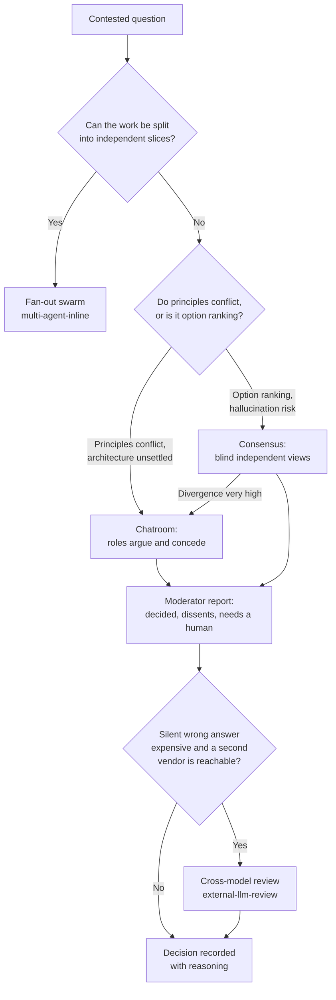

# Getting more than one answer: consensus, chatroom, and cross-model review

A model's first answer is a single sample from one viewpoint. For most tasks that is fine, and
the review gate catches the rest. For a contested design, a go/no-go with real cost on both
sides, or a research synthesis built from several sources, one sample is not enough. The cure is
not "ask again." It is "ask differently": several viewpoints on one undivided question, compared
in a way that keeps the disagreement visible instead of averaging it away.

This document covers the three shapes the harness uses for that, in rising cost: consensus
(blind independent views), chatroom (roles that argue and concede), and cross-model review (a
different model family attacking the result). It also says when each one is theater.

This document assumes you have read `docs/operating-process.md` and `docs/model-tiering.md`.

## Three shapes, one question

| Mode | The question it answers | Who sees whom | What it outputs | Template or skill |
|---|---|---|---|---|
| Consensus | Which option, and how sure are we? | workers are blind to each other | consensus, divergences, outliers, recommendation, confidence | `templates/project/context/consensus.md` |
| Chatroom | What should this be, given principles that conflict? | roles read and answer each other, two rounds | agreements, disagreements, recommendation, unresolved risks, plus what needs a human | `templates/project/context/chatroom.md` |
| Cross-model review | What did our own model family miss? | a different vendor reads the artifact by path | a VERDICT line plus severity blocks | `skills/external-llm-review/SKILL.md` |

All three differ from a plain fan-out. `multi-agent-inline` splits the work into slices, and its
own trigger names the case: "3+ explicitly enumerable independent slices in the task body."
Consensus and chatroom split the viewpoint on one unsplit question instead. If you can enumerate
slices, you want a swarm, not a debate.



The "divergence very high" edge is the consensus template's own escalation rule, quoted below.

## Consensus: independent views, then measure the spread

The rule that makes consensus work is the template's own line: "Each worker reasons
independently. Workers must not see each other's outputs during generation." A worker that sees a
peer's answer anchors on it, and the spread you were trying to measure collapses before you can
read it.

Configuration follows the template's default of five workers for normal tasks, up to ten for
high-variance strategy work, recorded with the `SWARM CONFIG` line from
`templates/project/context/multi-agent-inline.md`: `count=N model=<m> effort=<e>
est_cost_tier=<low|medium|high>`. MID-tier workers are normal for this. Go up to FRONTIER-DO when
the question is the kind `docs/model-tiering.md` already sends up: irreversible, outward-facing,
or a silent-wrong-answer cost that a test would not catch.

Synthesis sorts everything into consensus (majority agreement), divergences (meaningful
disagreement), outliers (minority positions with signal), a recommendation, and a confidence
note. The template's edge cases matter more than the buckets: "if all workers agree, note it and
verify it is not groupthink," and "always include divergences even when there is a clear
majority." A consensus report that drops its own divergence section has quietly turned itself
back into a single opinion.

There is a steelman variant worth naming separately: one advocate per option, each arguing
against the same fixed criteria, each required to name its own strongest weakness, each ending
with the condition under which its option wins, plus one independent adversary who defends
nothing. This borrows the chatroom's Critic discipline without opening a debate. The advocates
still do not see each other; only the report sees all of them. Worked example 2 below shows the
shape end to end.

Report location: `active/consensus/<run-id>.md`.

## Chatroom: roles that argue, concede, and stop

A chatroom has two role shapes, and the shape you pick should match the kind of tension in the
question.

Lens roles fit a design where the tension is between qualities rather than concrete
alternatives. The template's default three: Architect ("will this hold under growth and
change?"), Pragmatist ("can we build and run this with what we have?"), Critic ("what breaks,
what was missed, what is being oversimplified?").

Stance roles fit a design where the tension is between concrete alternatives: one advocate per
candidate option, a skeptic whose stance is "extend what exists, do not build something new," and
a neutral moderator. The moderator never debates in either shape. It only synthesizes.

Both shapes run the same two rounds, quoted from the template: round 1, "each role states their
position independently," and round 2, "each role responds to the others, defends or concedes, and
refines their position." In practice, round 2 needs to be more disciplined than that sentence
implies, or it degenerates into restating round 1. The debater files from a real run used one
skeleton throughout: an opening position per contested decision, grounded in the shared research
briefs by number rather than opinion, then "where I expect push-back and pre-emptive responses,"
then "rebuttals and concessions" with explicit `Concede:` and `Hold:` lines per point, then a
final position.

The moderator's report is the termination mechanism, and it is the part most worth copying
directly: Convergence, then per decision the strongest argument on each side, where the debate
ended up, and the recommended call, then Open dissents kept verbatim, then Decisions needing a
human, each paired with the evidence that would settle it. The rule underneath all of that: a
chatroom ends when every open item has either a call or a named falsifier. "It depends" is a
failed termination, not a cautious one.

The payoff a chatroom can produce that a vote cannot: a real run collapsed a false binary between
two competing storage designs, and the moderator's report said so directly: "The Option A /
Option C framing was a false binary; the right answer is layered." Nobody proposed the layered
answer in round 1. It only showed up because the two advocates kept arguing past each other in
round 2 until the report writer had to reconcile them.

Dissent that is not resolved should still survive the report, not be smoothed over. One run's
moderator wrote: "it is preserved verbatim in intent; it is not smoothed into false consensus."
The dissent in question was an unanswered worry that a storage convention had no enforcement
mechanism. It sat as an open risk for a while, and later a structural change (an append-only
event log) dissolved it by construction. A dissent you erase in the name of a tidy report cannot
do that later work for you.

A chatroom's decision can also get a second pass: a lens panel (feasibility, risk, simplicity in
one real run, not a fixed set) reviewing the synthesis, each lens returning approve-with-changes
and a severity-ranked issue list. In that same run, the simplicity lens caught a sequencing
error before it shipped: "Step 5 is the load-bearing falsifier. If it fails, steps 2-4 are sunk
cost. The correct step 1 is a ten-minute spike." That panel reviews the decision; it is a
separate step from the debate that produced it.

Anti-drift rules, quoted from the template: two rounds by default, three at most; if all roles
immediately agree, the problem may be underdefined and the question should be revisited; the
Critic must surface at least one risk even on strong proposals; if no agreement is reachable
after three rounds, escalate to the operator with explicit options.

Report location: `active/chatroom/<run-id>.md`, with per-role files beside it in
`active/chatroom/<run-id>/`.

## Cross-model review: a different family attacks the result

This section is short on purpose. For mechanics, read `skills/external-llm-review/SKILL.md`
directly and see `docs/planning-large-builds.md` for where it sits in the gate stack.

The reason to reach for a different vendor at all: "A different model family catches defects
Claude review misses. A Claude reviewer is NEVER a substitute." Same-family reviewers tend to
share blind spots, and a same-family cross-check can look like independent confirmation when it
is really the same training biases agreeing with each other. Model-model agreement is not
accuracy.

Four mechanics make a cross-model comparison more than an average of opinions:

1. **Blind rescoring by a model that did not discover.** The scoring brief withholds prior
   ranks: "Do not include prior rankings in the input. Do not infer that the order of the input
   reflects quality." The output names a strongest and a weakest reason per item, then explicit
   overrated and underrated lists, so a reader can see exactly where the two rankings diverge and
   why.
2. **A contradictions table, not a footnote.** Conflicting findings get a row of their own:
   "Claim / Tension | Evidence on Each Side | What To Do Next," and the resolution step requires
   sections for "cases where the opposite choice is better" and "decisions to postpone until
   implementation." A synthesis that has no contradictions table has usually just deleted the
   contradictions.
3. **Commit the attack to disk before the synthesis.** The rule stated in one real run: "so the
   synthesis can't quietly soften its own critique." Writing the adversarial pass first, and
   freezing it, keeps the final write-up honest about what it is choosing not to fix.
4. **Attack the right target.** The reviewer's guardrail: "over-softening a well-supported finding
   is itself an honesty failure." A brief that names which claims are hand-verified fact and
   which are model-derived labels keeps the attack aimed at the labels, not at ground truth.

The cheapest step in this family is a same-LLM fresh-session review, not a different vendor at
all: "Do not assume the previous output is correct." Route by what is wrong with the output, not
by habit: output that is good but messy gets a fresh session in the same family; output that may
contain hallucinated sources or needs stronger criticism gets a different family's adversarial
review; output whose rankings came from the same model that discovered the sources gets blind
rescoring somewhere else.

When two reviewers disagree, the skill's own rules apply: an executing reviewer beats a reading
one; a reviewer's summary can contradict its own body, so follow the body; the reviewers do not
overlap, so fold both findings in rather than treating either as a superset of the other.

**Honesty box.** In the work this document draws from, opposing roles inside a debate were
always same-family subagents. Different vendors were used to review, rescore, and detect
contradictions, never to hold an opposing role in an argument. Nothing here claims a cross-vendor
debate was run. If you run one, the briefing rules in the next section apply unchanged.

## Briefing a role so it is not a strawman

- Fix the same criteria for every advocate before dispatch, so nobody is arguing against a
  different scoreboard.
- Mirror the checklist: for every "one example of a bug this prevents" the opposing side gets
  "one concrete pattern that gets harder."
- Every advocate names its own strongest weakness, inside its own brief, not left for the
  opposing side to find.
- Every verdict is a condition, not a score: "option X wins when..." rather than a bare rating.
- Ground claims in the shared research briefs by number. Opinion without a cited brief does not
  count in round 2.
- Give one role nothing to defend: "no option advocacy, find what each side hides."
- The moderator is not a debater, and it sits at or above the debaters' tier, never below.
- Put the for-case and against-case per option into the contract's acceptance criteria, so the
  run cannot pass without them.

A copy-pasteable advocate brief:

```
ROLE: Advocate for Option <X>. You argue FOR <X> and only <X>.
DECISION: <one sentence>. OPTIONS: <A>, <B>, <C>.
CRITERIA (same for every advocate, argue each one): 1. ... 2. ... 3. ...
GROUNDING: cite the research briefs by number (01_..., 02_...). Unsupported claims do not count.
REQUIRED SECTIONS, in this order:
  ## Case for <X>          one subsection per criterion
  ## Strongest weakness of <X>   the single most damaging argument against your own option
  ## Verdict               the CONDITION under which <X> is the right call, not a score
WRITE TO: active/swarms/<run-id>/0N_advocate-<X>.md. Do not read the other advocates' files.
```

And the adversary variant, for the role with nothing to defend:

```
ROLE: Independent adversary. You defend nothing. Your job is to find what each advocate hides.
For each option: "The advocate's framing" then "The real failure mode the advocate downplays".
Then answer the core question yourself, with reasoning that does not depend on any advocate.
```

## Worked example 1: a design disagreement (chatroom, stance roles)

Generalized from a real cross-tool session-state design run. A team wants three different coding
agents to share project state, so a session started in one tool can be resumed in another. Two
decisions were contested: where the shared state lives (per-tool home directories versus one
unified store), and how concurrent writes are handled (git only versus tool-namespaced sections).

The moderator's brief was five lines: the two decisions, the four stances (per-tool advocate,
unified-store advocate, a third advocate for compile-to-many distribution, and a skeptic), two
rounds then a report with Convergence, per-decision verdicts, Open dissents, and Decisions
needing a human each with the evidence that would settle it, and the tier for debaters and
moderator.

Round 1 excerpts, one stance each. Per-tool advocate: "a tool belongs in a PATH, not just a
FIELD, because each tool already writes to its own home dir and fighting that costs more than it
saves." Unified-store advocate: "must a handoff cross tool boundaries within one repo? Yes; that
is the entire stated goal." Skeptic: "every proposal here assumes we need to build something new.
We do not. Build for the problem you have, not the problem you imagine."

Round 2 showed both a concession and a hold. The per-tool advocate conceded: "I accept the
hybrid... I was wrong to resist it." The skeptic held its ground on enforcement: "disjoint
sections are a local convention with no governance enforcement."

The moderator's report, condensed: Convergence landed on a layered two-tier design, with the
line "the Option A / Option C framing was a false binary." The first decision got a recommended
call. The second decision got a partial call with the skeptic's dissent preserved verbatim.
Decisions needing a human carried one full entry, including "evidence that would settle it: a
brief smoke test wiring a second tool's session-start hook to read the handoff file; if that
fails, the cross-tool handoff claim is unvalidated."

What happened next, in two sentences: a three-lens panel reordered the plan so the smoke test
became step zero instead of step five, and a later advisor pass dissolved the surviving
enforcement dissent with a structural change, an append-only event log. Both outcomes trace back
to the dissent being preserved instead of smoothed away.

## Worked example 2: a go/no-go (consensus with steelman advocates and an adversary)

Generalized from a real retry-loop decision. The question: should a one-time, attended
install-and-smoke test be wrapped in an autonomous "iterate until green" loop, and if so, with
which of three mechanisms: a model-judged soft loop, a plugin with a mechanical iteration cap, or
no loop at all with a human as the gate.

The contract's request line: "review the options, make the argument for and against each, reach
a consensus, synthesize the final result." Its acceptance criteria required a for-case and an
against-case per option, the core question answered decisively, a single recommendation with a
stated confidence, and every worker output persisted and verified on disk.

The `SWARM CONFIG` line recorded three steelman advocates (one per option) plus one independent
adversary, all MID tier. One advocate's brief showed the pattern: a "Strongest Weakness of A"
section that named its own worst failure mode honestly, followed by a verdict written as a
condition: "the condition under which A wins is precisely this one: short-run attended smoke,
blast-radius-contained."

The adversary found something none of the three advocates had: "Against B, the loop tool
re-feeds the same prompt every iteration, but 'install server, start process, run session' is
NOT idempotent." That footgun appeared in no advocate brief, which is exactly the value of a role
with nothing to defend.

The consensus report, condensed: a consensus item stating "the decisive reason is signal
trustworthiness, not cap mechanics," a divergence recorded with its rebuttal rather than deleted,
an outlier worth keeping, a recommendation, and a confidence paragraph with the groupthink check
written out explicitly: not groupthink, because the adversary was tasked to attack all three
options and still landed on the same answer through independent reasoning.

Termination: the decision corrected a landed plan line that had claimed too much, and it produced
a learned rule, not just a choice: an autonomous loop is only worth wiring when the acceptance
signal is machine-checkable. The deliberation's product was a rule that will apply to the next
decision too, not only an answer to this one.

## Worked example 3: a post-incident review (chatroom, lens roles) -- constructed

This example is constructed for this document. No post-incident chatroom of this shape exists on
disk. It is built on a failure this repo already records in `docs/anti-patterns.md`: a reviewer
wrapped in a timeout that does not exist on macOS produced a tiny file and exit 0, and a size
check read that as a terse clean review.

The question was framed first, not as "whose fault," but as "what must change so a review gate
cannot close on a file nobody read?"

Round 1, one paragraph each. Architect: the gate should assert on content, and line one of a
review file must be a VERDICT line. Pragmatist: the actual fix is two lines in the gate script and
a note in the skill; do not build a review-result schema for this. Critic: the size check was
already "a check that cannot fail," and the same failure class exists wherever else a check
passes on empty input, naming a reconnect-loop case as another instance of the same class.

Round 2, with concessions: the Architect conceded the schema was overbuilt for this fix. The
Pragmatist conceded the class-wide sweep was worth doing, not just the one instance. The Critic
held that the sweep must be a listed action with a named owner, not a vague intention.

The moderator's report: three agreements, no material disagreement, a recommendation of the two
concrete gate changes plus the sweep, and one unresolved risk, that the sweep is a listed action
and not yet done. The outcome matches what the skill now says: never close a gate on a file you
have not read line one of.

This example is short on purpose. Its job is to show lens roles in action and to show the Critic
producing a risk even when the debate ends in agreement.

## Worked example 4: cross-model research synthesis

Generalized from a real executive research project: a research package assembled from several
vendors' outputs for a skeptical executive audience. The chain ran as a numbered sequence.

1. One brief and one output schema, one folder per vendor. The project instruction: "separate
   evidence from inference from recommendation... attack unsupported claims."
2. Merge with a contradictions table. The merge instruction: "do not reward repetition." A
   required section, "SECTION 2, contradictions and tensions," held claim, evidence on each side,
   and what to do next.
3. An adversarial attack pass named specific seams to attack, and the file was saved to disk
   before the next step began.
4. A synthesis pass that down-ranked anything the attack had flagged as over-claimed.
5. A reconciliation gate: "if anything disagrees, the ledger wins."

The pruning story, in two sentences: a lens panel reviewed the remaining follow-up questions and
judged most of them "confirmation theater," keeping only the ones that would "verify a live,
falsifiable claim." Deliberation that cannot change the decision gets cut, no matter how cheap it
would be to run.

## When this is overkill

The test that decides it: could the outcome actually change the decision? If not, skip the mode.

- The chatroom template's own list still applies: simple tasks, ranking without a principle
  conflict, narrow implementation where the approach is already clear.
- Watch for "confirmation theater": a review step, a rescoring pass, or a round of debate that
  can only ever confirm what you already believed. The research project above pruned most of its
  own follow-ups on exactly this ground.
- All-agree is a signal, not a success: if every role or worker lands in the same place
  immediately, the question may be underdefined, and the fix is to revisit the question, not to
  declare consensus.
- This is a tier-up decision, and `docs/model-tiering.md` already asks the question that governs
  it: justify the extra cost by what a silent wrong answer costs here, never by habit.
- If the task has enumerable slices, you want a fan-out swarm, not a debate; running a chatroom
  over work that could have been split is the expensive way to do the wrong kind of task.

A chatroom on a question the repo already answers is the most expensive way to read a file.

## Where the reports go and what the decision leaves behind

A triggering run leaves behind a contract, a run output, and a verification report as a matter of
course. On top of that, a consensus or chatroom mode adds its own report at `active/consensus/
<run-id>.md` or `active/chatroom/<run-id>.md`, with per-role or per-worker verbatim files beside
it. When the run produces a decision worth reusing, it also gets a decision log entry, and when
it produces a generalizable rule, that rule gets appended separately. The run-id format is
`YYYY-MM-DD_<short-slug>` throughout.

The moderator reads each per-role file back from disk rather than carrying it forward in context,
which is what makes a chatroom report auditable after the fact instead of a paraphrase of a
conversation nobody can re-read. If the panel outlives the session that started it, see
`docs/handoff-and-resume.md` for what the next session needs to pick it back up.
