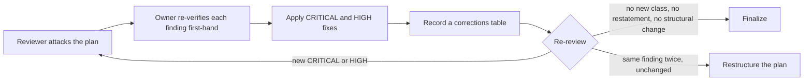

# The full lifecycle: from an idea to a deploy

## Before you read this

This document assumes you already know three things `docs/glossary.md` defines:
[`advisor`](glossary.md#advisor), the host's built-in
[`Plan` subagent](glossary.md#the-host-built-in-subagent-types-plan-explore-general-purpose), and
[the Workflow tool](glossary.md#the-workflow-tool). It also assumes you have already read
`docs/first-day.md` and `docs/operating-process.md`.

This article also describes an optional external second-opinion review step. That step requires
one of several third-party CLIs (`skills/external-llm-review/SKILL.md` names codex, cursor-agent,
and gemini) installed and authenticated on your machine. If you do not have one of those set up,
that step does not apply to you, and the gate is the rest of the stack: the test command, the
`adversary` agent, `/ponytail-review`, re-running the tests, and merging. Do not treat the external
review step as required; it is a strengthening step, not a floor.

`docs/operating-process.md` runs one task through seven steps, once. This document is for a
different shape of work: a build that gets planned, improved over several review rounds, frozen,
executed in waves by many agents, and then finished, with a human at specific, named boundaries.
If your work is one task from a clear starting point, read `docs/operating-process.md` instead.
If it is a build that will run unattended for hours or span multiple sessions, this is the map.

## The map

```mermaid
flowchart LR
    A[Scope<br/>scope-audit skill] --> B[Plan<br/>/deep-plan or deep-plan-swarm]
    B --> C[Improve<br/>advisor, design-reviewer, external-llm-review]
    C --> G1{{Plan approval<br/>ExitPlanMode or written approval}}
    G1 --> D[Finalize<br/>phases tree, AUTORUN mission]
    D --> E[Orchestrate<br/>worktrees, exec-* agents]
    E --> F[Execute<br/>autorun-plan or heartbeat]
    F --> H[Review<br/>per-wave gate stack]
    H --> I[QA<br/>done-when scripts]
    I --> J[Red team<br/>adversary on integration diff]
    J --> K[Fix iterations<br/>class closure]
    K --> G2{{Final review and deploy<br/>code-reviewer, AUTORUN-REPORT, human gate}}
```

Human gates are drawn as hexagons because there are exactly two kinds in this harness, and a reader
should see at a glance that they are not the same kind. The first is plan approval:
`skills/deep-plan-swarm/SKILL.md` ends there ("ExitPlanMode for approval. Do not execute."). The
second is any hard-stop category during execution, per `AGENTS.md` ("Stop and get explicit human
approval before: modifying production systems or databases, deleting or migrating data, changing
authentication, authorization, billing, or secrets, deploying to external hosting, using any
permission-bypass flag, legal, compliance, or financial workflows, any irreversible action with
external cost or impact"). Deploy is item four on that list, not a third kind of gate, which is why
the diagram folds the final-review stage and the deploy gate into a single terminal hexagon: every
build that reaches this point reaches a human decision, whatever the review that led up to it found.

Stage by stage, the mechanism and the artifact that crosses to the next stage:

| Stage | Mechanism in this harness | Artifact that crosses to the next stage |
|---|---|---|
| Scope | `scope-audit` skill | `.project-state/SCOPE-<system>.md` |
| Plan | `/deep-plan` (bounded) or the `deep-plan-swarm` skill with `plan-synthesizer` (large) | the plan file, four-part shape plus AUTORUN mission and verification |
| Improve (rounds) | advisor critique; `design-reviewer` agent (recommended, see below); `external-llm-review` skill when a CLI exists | a corrections table per round, appended to the plan file |
| Finalize | ExitPlanMode approval (plan mode) or the operator's written approval; a `phases/` tree from `templates/phase/` | the approved plan, the mission section, `phases/CLAUDE.md` |
| Orchestrate | the plan's Workflow-vs-Agent verdict; a worktree per stream; named `exec-*` agents; `hooks/require-agent-model.sh` | branches with exclusive file ownership; a SWARM CONFIG line |
| Execute | `autorun-plan` skill via `autorun-plan-orchestrator` (unattended, gated) or `heartbeat` skill (watched, already-approved) | commits per branch, `AUTORUN-STATE-<slug>.md` or `HEARTBEAT-STATE-<slug>.md` |
| Review | the per-wave gate stack (tests, `adversary`, `/ponytail-review`, optional external fold-back, re-test, merge) | a merged wave |
| QA | machine-checkable done-when per phase; the full suite run in the main checkout | green in the main checkout (see `docs/finishing-a-build.md`) |
| Red team | `adversary` on the integrated diff; `verify-unexecuted` for scripts that cannot run at build time | severity-ranked findings, written to a file under `runtime/` |
| Fix iterations | class closure, stopping by class, guarantee-vs-claim (all in `skills/autorun-plan/SKILL.md`) | closure artifacts and a mutation manifest |
| Final review and deploy | `code-reviewer` against the plan; `.project-state/AUTORUN-REPORT-<date>.md`; `/handoff`; deploy is a human gate by category | the report, the resume prompt, a deploy decision handed to a person |

## Why the planning investment pays: the harness's own evidence

Skipping ahead to execution because a plan feels obvious is a recurring mistake this harness has
already made and recorded. Four pieces of evidence:

1. Estimates were off by an order of magnitude, and every review round still found something real.
   `skills/deep-plan-swarm/SKILL.md`: "one 10-file shell phase the plan called 'a cheap gate' took
   ~3 hours and three adversarial rounds without closing -- and every round found real blockers, so
   the cost was legitimate, not waste. Estimates written at planning time were off by an order of
   magnitude, and that miscalibration silently sets the wave order, the nightly scope, and the
   operator's expectations."
2. Half a plan aimed at dead surface, and review alone cannot catch that.
   `skills/scope-audit/SKILL.md`: "A 2,695-line plan survived 32 review rounds and an approval, and
   nobody asked whether the surface it improved was ever used." And: "Review checks whether a
   requirement is *correct*, not whether its *subject matter is alive*."
3. A planned build that gated the operator zero times mid-build.
   `templates/project/knowledge/autonomous-build-loop.md`: "Operator gated ZERO times mid-build;
   the single decision handed up was the Level-C live-wiring gate."
4. A fix round structured by the plan's own class-closure rule found a defect nobody was looking
   for. `skills/autorun-plan/SKILL.md`: "the first class-closure round **found a fourth route for
   free while building the table** -- a finding that would otherwise have been another full round."

The principle underneath all four: the plan is the only artifact guaranteed to survive a context
clear or a session ending mid-build, so the effort spent making it correct is the only effort that
compounds across the rest of the build. `docs/planning-large-builds.md` already states the file-on-disk
version of this ("The plan has to be a file on disk, written before any code changes, because the
file is the only thing guaranteed to still exist when the next session picks up the work.") -- see
that document for the mechanics of writing one; this is why it is worth the cost.

## How the FRONTIER-THINK synthesis planner works

`docs/planning-large-builds.md` covers what `plan-synthesizer` is. This section covers what it
consumes, what it emits part by part, and which harness feature each part binds to.

What it consumes. `agents/plan-synthesizer.md`: "You are handed a body of already-gathered material
-- investigation-swarm reports, one or more prior plans, a registry of findings, operator decisions
-- and you produce a SINGLE structured execution plan from it. You do not gather from scratch; you
synthesize, reconcile, and decide." It also receives the scope document, per `skills/deep-plan-swarm/SKILL.md`:
"the planner receives the scope doc and must justify any phase touching dead surface."

What it emits: the four-part shape from `commands/deep-plan.md`, plus two tails. `agents/plan-synthesizer.md`:
"Emit these parts, in this order. This is the deep-plan four-part shape plus two tails."

| Part | What it holds | Harness feature it binds to |
|---|---|---|
| 1. How to execute | waves, isolation, review gates | Worktrees: "one git worktree + feature branch per concurrent workstream, with an explicit exclusive file-ownership table so parallel work is verifiably conflict-free." Human gates: the four-condition rule ("(a) the pass/fail rule CANNOT be stated in advance ... (b) the action reaches a person outside the system; OR (c) the action is IRREVERSIBLE and lacks a tested rollback; OR (d) it requires physical human action"). The gate stack: "Bake into EVERY code-producing wave's gate, in order." |
| 2. Workflow-vs-overkill verdict | "Workflow tool warranted" / "Workflow overkill -- use N parallel Agent subagents" / "inline" | the Workflow tool versus Agent subagents; `skills/autorun-plan/SKILL.md` executes whichever the plan says ("Workflow vs Agent: follow the plan's verdict.") |
| 3. Per-phase model/effort matrix | a table, plus the same annotation inline in every phase heading | the tier rules and the hook. `agents/plan-synthesizer.md`: "Route every phase to a PINNED agent definition by name (`exec-mechanical` / `exec-standard` / `exec-critical` / `exec-subtle`, reviewers `adversary` / `design-reviewer`) -- never a bare `model:` param, which drops the effort pin and trips the require-agent-model hook." A plan names a tier, never a model; `config/models.conf` binds tiers to real models. |
| 4. The phases | numbered, absolute paths, edits, traps, verification, next-step commands | `templates/phase/` (goal, done-when, verification, rollback); `/phase-status` and `/next-step` read the result |
| 5. AUTORUN mission | kickoff line, phase order, delegated decisions, hard aborts, mechanics | `skills/autorun-plan/SKILL.md` step 0 reads it: "Read the mission file the operator named (or the plan's AUTORUN section if none exists yet)." This is the finalize seam, covered below. |
| 6. Verification | commands and expected outputs, before/after diff protocol for derivation | the test command the plan names. `agents/plan-synthesizer.md`: "tests green (the command the PLAN names for this repo; read it, never assume one)." For this repo that command is `./verify.sh`. For a different repo it is that repo's own suite; `verify.sh` is not a universal first step. |

Two more binding points worth knowing before you write or read a plan:

The `.project-state/` files the pipeline writes, in order of appearance:

| File | Written by | Source |
|---|---|---|
| `SCOPE-<system>.md` | the scope-audit step | `skills/scope-audit/SKILL.md`: "Write a durable scope file (e.g. `.project-state/SCOPE-<system>.md`)" |
| the plan file | the plan or plan-synthesizer step | `docs/operating-process.md`: "a plan file under `.project-state/` for a swarm run merging plans" |
| `AUTORUN-STATE-<mission-slug>.md` or `HEARTBEAT-STATE-<mission-slug>.md` | the executor, every meaningful step | see `docs/autorun-hitl-heartbeat.md` |
| `AUTORUN-REPORT-{date}.md` | close-out | see `docs/finishing-a-build.md` |
| `SESSION_HANDOFF.md` | any stage boundary that needs a handoff | `docs/handoff-and-resume.md` |
| `ERRORS.md` rows | whatever broke | project convention |

And the handoff discipline is not only a close-out step; it applies at every stage boundary in this
list. `skills/autorun-plan/SKILL.md`: "Context degradation: write STATE fully -> spawn `claude -p
--model <explicit, never inherit>` ... -> verify that worker's **first** STATE write landed -> end
this loop."

Finally, the planner itself never touches the repo. `agents/plan-synthesizer.md`: "Never edit or
commit. Your final message IS the plan; the orchestrator writes it to disk." Whatever agent invoked
the planner is the one that persists the result.

## Improvement rounds: what a round is and when to stop

This is the stage no existing doc covers.

**What a round is.** One reviewer attacks the current plan file. The plan owner re-verifies every
finding first-hand against the code (not against the reviewer's claim about the code), applies the
CRITICAL and HIGH fixes, records a corrections table, and sends the same file back.
`skills/deep-plan-swarm/SKILL.md`: "**Re-verify every finding first-hand**, record a corrections
table, apply fixes, and **re-review until a round returns no new CRITICAL/HIGH findings. There is
NO round cap.**"

**The reviewer ladder, in order.** Each rung is a different pair of eyes, and a plan runs the whole
ladder it has access to.

1. The advisor critique. `commands/deep-plan.md` step 4: "load-bearing risks the plan missed,
   unstated assumptions, cheaper alternatives, whether the parallelization is actually safe
   (disjoint files? real dependencies masked as parallel?), whether the Workflow-vs-Agent verdict
   and the model/effort right-fitting are sound."
2. Recommended: dispatch the `design-reviewer` agent against the plan file. Its own definition
   describes exactly this use: "Reviews plans and designs against the real current state of the
   code; traces failures to root cause; critiques architecture adversarially." And: "Use for
   plan-drift verification, design critique, and deciding whether an approach will actually work
   before anyone writes code." It is not wired into `/deep-plan` or `deep-plan-swarm` today -- it
   appears only in `skills/autorun-plan/SKILL.md`'s reviewer catalog, listed as "Plan/design vs live
   code." Dispatch it by name (its own definition pins the tier), give it the plan path and the
   scope file, and tell it to write its report under `runtime/` before finishing.
3. The external reviewer, only if a CLI exists. Same framing as above: a strengthening step, not a
   floor. The default at planning time is codex when the plan is silent on which to use
   (`skills/external-llm-review/SKILL.md`: "Planning skills default to **codex** only when the plan
   is silent.").

**When a round added nothing.** No single skill states this rule for plans directly; it is
recommended here, drawn from three sources that state closely related rules. First,
`skills/deep-plan-swarm/SKILL.md`'s own stopping condition: no new CRITICAL/HIGH, no round cap,
escalate if the plan is not converging. Second, `skills/external-llm-review/SKILL.md`: "Same
finding twice unchanged, or a restatement round: escalate (needs restructuring)." Third,
`skills/autorun-plan/SKILL.md`'s stopping rule, written for execution but the same logic applies to
a plan under review: "the round returned no new CRITICAL/HIGH, **counted by class**."

A plan round added nothing when all three hold: it returned no new CRITICAL or HIGH finding counted
by class, not by instance; every finding it did return restates one already in the corrections
table; and the corrections it proposed would change wording, not waves, ownership, gates, or the
model matrix. When all three hold, the loop ends. When the same finding returns twice unchanged, the
plan needs restructuring, not another round. A fixed round count is never the stopping condition.

The execution-time discriminator applies to plans too. `skills/autorun-plan/SKILL.md`: "Does the
finding break the thing the PHASE PROTECTS, or does it break a CLAIM a previous fix round invented?
The first is a must-fix. The second gets the **CLAIM NARROWED** -- never the code widened." For a
plan under review, read "code widened" as "scope widened."

**What a round must not do.** Widen scope past the scope file. `skills/scope-audit/SKILL.md`: "A
plan phase earns its place ONLY if it touches something on the IN SCOPE list." Re-argue a decision
the operator already recorded. Add a gate whose only content is "looks right":
`agents/plan-synthesizer.md`: "If you find yourself writing a gate whose only content is 'operator
confirms this looks right', delete it and write the rule instead."

## Finalize: turning an approved plan into a runnable mission

No existing doc covers this seam either. As a checklist:

1. Approval is an event, not a feeling: ExitPlanMode in plan mode, or the operator's written
   approval line in the plan file with a date. `skills/deep-plan-swarm/SKILL.md` ends at approval
   ("Do not execute the plan from this skill -- it ends at approval. Execution is `autorun-plan` /
   `autorun-plan-orchestrator`.").
2. Confirm all six parts are present. `commands/deep-plan.md` step 3 already confirms the first
   four of them: "Confirm it carries all four required parts ... if any is missing, send the Plan
   subagent one follow-up to add it rather than patching it yourself."
3. Confirm every phase heading carries `[agent: ..., model: ..., effort: ...]` and every named
   agent exists (`ls agents/` and the project's `.claude/agents/`). `skills/autorun-plan/SKILL.md`
   stops a stream on a missing definition: "If a named def is missing in both places, STOP that
   stream and report; do not inherit a parent model as a workaround."
4. Name the reviewers, or accept the defaults. `skills/external-llm-review/SKILL.md`'s resolution
   order: operator instruction this session; the plan's field for this phase (`planning_reviewer`
   versus `execution_reviewer`, which may differ); the planning-skill default, codex; or, if the
   named CLI is dead, report unavailable. If no CLI exists, write `external review: unavailable,
   <reason>` into the plan's mission section now, so the run copies it into its state file on first
   wake -- the harness rule itself names only the state file (`skills/autorun-plan/SKILL.md`:
   "record `external review: unavailable, <reason>` in AUTORUN-STATE once, skip step 4 in every
   wave, and go straight from 3 to 4.5").
5. Write the premises list. `skills/deep-plan-swarm/SKILL.md`: "state, in one line each, the
   **premises** the plan rests on (what must be true for this work to be needed). Premises rot;
   naming them makes later falsification detectable instead of invisible."
6. Choose the executor with the decision table in `docs/autorun-hitl-heartbeat.md`.
7. Lay out `phases/` from `templates/phase/` when the build spans sessions; the nested pattern keeps
   context small (`docs/planning-large-builds.md`).
8. Freeze any shared contract first. `agents/plan-synthesizer.md`: "The shared contract/interface
   lands FIRST and ALONE, then fan out."

## Orchestrate: dispatching the waves

Mostly a cross-reference to `docs/planning-large-builds.md` and `docs/model-tiering.md`. The
substance this document adds is the dispatcher's contract and the resolution order:

- Every `exec-*` brief carries three things. `docs/writing-your-own.md`: "Whoever dispatches an
  `exec-*` agent must supply all three in the brief: which files, which worktree, and where to
  write the report." The report path goes under `runtime/`, which is gitignored.
- Definition resolution order. `skills/autorun-plan/SKILL.md`: "Resolve agent definition in order:
  **the plan's per-phase matrix** -> project `.claude/agents/<name>.md` ->
  `~/.claude/agents/<name>.md`. Prefer the project copy when both exist."
- The hook is the floor underneath all of this. `hooks/require-agent-model.sh`: "Denies Agent/Task
  spawns that would silently inherit the parent session's model: the call must either pass an
  explicit `model` parameter, or name a subagent_type whose definition file pins `model:`."
  `docs/model-tiering.md` covers what the hook cannot see.
- A SWARM CONFIG line goes out before any fan-out (`docs/operating-process.md`; the term is defined
  in `docs/glossary.md`).
- Every child writes its report to a file before finishing. `skills/autorun-plan/SKILL.md`: "**EVERY
  child writes its report to a FILE before finishing (binding).**" And the trap next to it: "**A
  report is done when the AGENT reports done -- NEVER when the file looks big enough (binding).**"

## Execute: minimal HITL, and why the rest is safe to automate

`docs/autorun-hitl-heartbeat.md` covers the mechanism in depth. What this section adds is the
reconciliation of two human-in-the-loop vocabularies the harness carries, so a reader does not meet
a third one partway through a build. Both exist today:

- Level A / B / C, from the workspace brain. `templates/project/rules/workflow.md`: "Level A --
  Self-Resolvable ... Level B -- Limited Clarification ... Level C -- Hard Stop."
- The four-condition rule, from autorun. `skills/autorun-plan/SKILL.md`: "A human stop exists ONLY
  if: (a) pass/fail cannot be stated in advance, (b) it reaches a person outside the system, (c)
  irreversible without tested rollback, or (d) physical human action."

Reconciled: the `AGENTS.md` hard-stop list IS Level C, by category, and no plan rule talks its way
past it. Inside everything that is not Level C, autorun's four conditions decide whether a stop
exists at all; a Level B "ask a short question" moment maps onto condition (a) -- the rule cannot be
stated in advance. Everything else auto-proceeds on a stated rule, and parks loudly the moment the
rule stops holding.

Why the rest is genuinely safe to automate, each with its source:

- Reversibility with a tested rollback. `skills/autorun-plan/SKILL.md`: "Never auto-proceed a
  live-data mutation without branch + precomputed patch + snapshot + **tested** rollback."
- A parked branch cannot idle the whole run. `skills/autorun-plan/SKILL.md`: "PARK THE BRANCH,
  CONTINUE THE REST."
- The state file makes a crash cost one step, not the run. `skills/autorun-plan/SKILL.md`: "Rewrite
  STATE after every meaningful step."
- The never-weaken list stays gated regardless of how clean the rule reads. `skills/autorun-plan/SKILL.md`:
  "sends that reach a person outside the system, deletion of tracked content, writes to a source of
  truth the plan marks read-only."

The one execution-time reason to stop and re-plan rather than push through is a premise dying
mid-run; see `docs/anti-patterns.md`, entry "The premise that died mid-run."

## Where this doc hands over

Review, QA, red team, fix iterations, final review, and deploy are covered in
`docs/finishing-a-build.md`.
