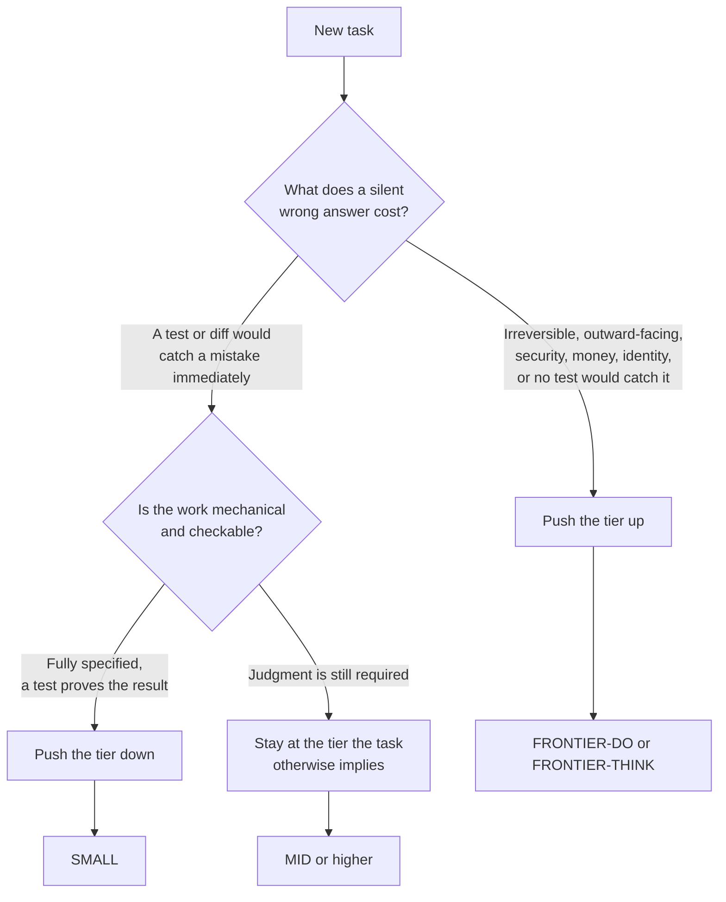

# Sizing the model to the task

Every model call in this harness, whether it is the main session or a subagent it
dispatches, gets an explicit size. Not "whatever the parent happens to be running," an
explicit, stated choice. This document explains the four sizes, the two questions that
decide which one a task gets, and the mechanics of how a size written in a plan or a
prose file turns into a real model name at runtime.

If you have not yet read [`docs/choosing-your-tools.md`](choosing-your-tools.md), the short version of what you
need here: a subagent is a delegated unit of work that runs in its own context and
returns a result, and a hook is a script that runs unconditionally and can block an
action outright, unlike an instruction the model merely reads.

## Contents

- [The four tiers](#the-four-tiers)
- [Naming a tier in prose, naming a model in config](#naming-a-tier-in-prose-naming-a-model-in-config)
- [Reviewers sit at or above the tier that produced the work](#reviewers-sit-at-or-above-the-tier-that-produced-the-work)
- [The hook that enforces the "never inherit silently" rule](#the-hook-that-enforces-the-never-inherit-silently-rule)
- [What the hook cannot see](#what-the-hook-cannot-see)
- [Rebinding when the roster changes](#rebinding-when-the-roster-changes)
- [The eleven agents in this repo](#the-eleven-agents-in-this-repo)

## The four tiers

`AGENTS.md` defines four tiers by what the task looks like, not by which model
currently fills the role:

| Task | Tier | Effort |
|---|---|---|
| Extraction, classification, mechanical grind, fully specified edits an existing test proves | SMALL | low to medium |
| Production prose, frontends, wiring, mid-complexity work against a pattern already in the repo, scaffolding tests | MID | medium |
| Correctness-critical logic: concurrency, locking, derivation, invariants, parsers, gates and validators, anything on a send, deploy, or money path, foundations others build on | FRONTIER-DO | high |
| The single subtlest workstream in a plan, and adversarial review of anything in the row above | FRONTIER-DO | max or xhigh |
| First-principles analysis, root-causing an unexplained failure, greenfield design, synthesizing many inputs into one plan | FRONTIER-THINK | high to max |

Two questions decide the tier for any given task:

1. **What does a silent wrong answer cost here?** If the failure is irreversible,
   outward-facing, touches security, money, or identity, or is the kind of mistake no
   test would catch, that pushes the tier up. A model that gets a config typo wrong is
   annoying. A model that gets a data migration wrong is a different category of
   problem, and the tier should reflect that before the fact, not after.
2. **Is the work mechanical and checkable?** If the task is fully specified in advance
   and a test or a diff can prove the result is correct, that pushes the tier down.
   Paying for a frontier model to remove a JSON entry a test already verifies is waste,
   not safety.

When you are genuinely unsure which way a task leans, go up for anything that can fail
silently and down for anything a test catches immediately. An oversized model on
mechanical work costs throughput. An undersized model on a silent-failure path costs a
defect nobody notices until it has already shipped.

### Why there are two frontier tiers, not one

FRONTIER-THINK and FRONTIER-DO are not "frontier, but slightly weaker" versus "frontier,
full strength." They differ by disposition: what kind of question the task is actually
asking.

- **FRONTIER-THINK** answers *what is really going on, and what should this be?* Use it
  for root-causing a failure nobody understands yet, greenfield design, or reconciling a
  pile of investigation into one coherent plan. This is thinking work: it produces
  understanding and decisions, not a working diff.
- **FRONTIER-DO** answers *is this actually right, and will it hold?* Use it for writing
  the correctness-critical code itself, and for adversarial review that tries to break
  what someone else wrote. This is doing-and-breaking work: it produces a diff, or a
  verdict on somebody else's diff.

A plan is FRONTIER-THINK work. Implementing the trickiest phase of that plan is
FRONTIER-DO work. Reviewing that implementation adversarially before merge is also
FRONTIER-DO work, at even higher effort, because review is where defects actually get
found and a reviewer that is weaker than the builder cannot see what the builder missed.
Confusing the two dispositions is a common mistake: dispatching your design questions to
the doing-and-breaking occupant, or your implementation to the thinking one, wastes the
tier's actual strength.

### The two sizing questions as a flowchart



An organization with access to only one frontier-class model does not get to skip this
split: it binds both `FRONTIER-DO` and `FRONTIER-THINK` to that same model in
`config/models.conf`, so plans and prose still name the disposition the task needs, and
the day a second frontier model becomes available, only that one file changes.

## Naming a tier in prose, naming a model in config

`AGENTS.md` states this directly: prose names the tier, executable config needs the
literal model name. The reason is mechanical, not stylistic. A plan, a skill, or a brief
that says "dispatch this at FRONTIER-DO" survives a model release completely
unchanged, because the tier is a description of capability, not a name. The same text
hardcoding `opus` becomes a wrong instruction the moment the roster moves to something
else. But a `model:` field in an agent's frontmatter, or a `--model` flag on a command
line, is read by something that does not understand English: it needs a literal string
it can pass straight to the model API.

`config/models.conf` is the single place that bridges the two:

```conf
TIER_FRONTIER_THINK=fable
TIER_FRONTIER_DO=opus
TIER_MID=sonnet
TIER_SMALL=haiku
```

Every shipped agent definition in `agents/` is written with a placeholder token instead
of a literal model name. Here is `agents/adversary.md` as it exists in the repository,
before installation:

```markdown
---
name: adversary
description: FRONTIER-DO tier at xhigh effort. Adversarial correctness reviewer...
tools: Read, Grep, Glob, Bash
model: {{TIER_FRONTIER_DO}}
effort: xhigh
reasoning: xhigh
---
```

`harness install --user` reads `config/models.conf`, then runs every agent and skill
file through a Perl substitution (`resolve_tiers` in `bin/harness`) that rewrites each
`{{TIER_*}}` token to its bound value before copying the file into `~/.claude/agents/`.
The installed copy that Claude Code actually reads looks like this:

```markdown
---
name: adversary
description: FRONTIER-DO tier at xhigh effort. Adversarial correctness reviewer...
tools: Read, Grep, Glob, Bash
model: opus
effort: xhigh
reasoning: xhigh
---
```

The source file in the repository never hardcodes a model name. The installed file
never contains a token the model resolver would not understand. Each half of the split
only has to handle the kind of content it actually understands.

## Reviewers sit at or above the tier that produced the work

A reviewer that is cheaper than the builder cannot see the builder's mistakes; it can
only confirm the things it would also have gotten right. This is why `adversary` (the
pre-merge correctness reviewer) and `design-reviewer` (the plan-and-design reviewer) are
both pinned to a frontier tier regardless of what tier built the thing they are
reviewing. Reviewing FRONTIER-DO work with a MID-tier reviewer is not a cost saving,
it is a review that will not catch what actually needs catching. Never economize on the
reviewer to afford the builder; if the budget is tight, spend it on the review, not the
build.

## The hook that enforces the "never inherit silently" rule

`AGENTS.md` states the rule: every delegated unit of work gets an explicit tier, and
none of them silently inherit the parent session's model. `hooks/require-agent-model.sh`
is what makes that rule actually hold rather than merely being requested.

It is wired as a `PreToolUse` hook, so it runs before every `Agent` tool call is allowed
to execute. Reading the script itself, here is exactly what it checks:

1. Read the tool call's JSON payload from stdin and pull `tool_input.model` and
   `tool_input.subagent_type`.
2. If `subagent_type` is `"fork"`, allow the call immediately. A fork always inherits
   the parent's model by design, since it is meant to be a continuation of the same
   conversation, so there is nothing to check.
3. If a `model` value was passed explicitly on the call, allow it.
4. Otherwise, look for an agent definition file named `<subagent_type>.md`, first in the
   project's `.claude/agents/`, then in the user's `~/.claude/agents/`. If that file
   exists and its frontmatter has a `model:` line with a non-empty value, allow the
   call: the agent definition itself supplies the pin, so the caller does not have to
   repeat it.
5. If none of the above holds, deny the call. The denial message names the reason
   (silent inheritance) and tells the caller to re-issue with an explicit model, sized
   using `config/models.conf`.

The one exemption in that logic, `fork`, is deliberate and stated in both the hook's own
comment and in `AGENTS.md`: it is not a loophole, it is the one subagent type for which
"inherit the parent's model" is the correct behavior by design.

## What the hook cannot see

A `PreToolUse` hook on the `Agent` tool only fires when that specific tool is called.
Several other places in this harness dispatch a model and are outside its reach, so
sizing them correctly is on you, by hand, every time:

- **Workflow scripts.** Any script using the Workflow tool's `agent()` call takes its
  own `model` and `effort` options. The hook never sees these calls; pass both
  explicitly on every one.
- **Headless `claude -p` invocations.** A `claude -p` call from a script, a cron job, or
  a job runner takes an explicit `--model` flag. Without it, the invocation falls back
  to whatever default the environment has, which may not match the task.
- **New agent definitions you write.** Creating a new file under `agents/` (or a
  project's own `.claude/agents/`) means pinning `model:` in its frontmatter yourself.
  Nothing checks that a *new* definition file is sensible; the hook only checks that
  *some* pin exists, not that it is the right one.

Treat the hook as a floor, not a ceiling. It stops the specific failure mode of a
subagent silently running on an unstated model. It does not review whether the tier you
chose was actually the right one for the task, and it has no opinion on anything outside
the `Agent` tool call it inspects.

## Rebinding when the roster changes

When a new model ships, or a machine has access to a different set of models than
usual, the fix is one line in `config/models.conf`:

```conf
TIER_FRONTIER_THINK=fable
TIER_FRONTIER_DO=opus
TIER_MID=sonnet
TIER_SMALL=haiku
```

Change the value on the right, re-run `harness install --user` (or `harness init` /
`harness add` for project-scoped copies) so the `{{TIER_*}}` tokens resolve again, and
every agent definition, skill, and command that names a tier now points at the new
model. Nothing else in the repository needs to change, because nothing else names a
model directly.

If something ships that is genuinely stronger than the current frontier, the correct
move is to **add a fifth tier**, not to quietly repoint FRONTIER-DO or FRONTIER-THINK at
it. "The best model available" is not a tier; it is a description that, if you let it
substitute for a tier name, turns every sizing rule in this document into "use the
biggest one" by the back door. A tier is defined by what kind of task it is right for,
and a model landing above the current frontier does not automatically mean every task
that used to warrant FRONTIER-DO now warrants something even bigger. Decide that on
purpose, in `AGENTS.md`, rather than letting it happen as a side effect of a config
edit.

## The eleven agents in this repo

| Agent | Tier | Effort | What it is for |
|---|---|---|---|
| `exec-mechanical` | SMALL | medium | Fully-specified, test-provable edits: config entries, plist keys, verified-safe deletions |
| `exec-standard` | MID | medium | Well-bounded implementation against a proven local pattern: new scripts, wording changes, smoke verification |
| `exec-critical` | FRONTIER-DO | high | Correctness-critical implementation: concurrency, locking, derivation logic, foundations other phases build on |
| `exec-subtle` | FRONTIER-DO | max | The single subtlest workstream in a plan: derivation over mixed historical data, invariants with a crying-wolf failure mode |
| `adversary` | FRONTIER-DO | xhigh | Adversarial pre-merge correctness review; tries to break the change, never edits |
| `design-reviewer` | FRONTIER-THINK | xhigh | Reviews a plan or design against real current code, read-only, never builds |
| `plan-synthesizer` | FRONTIER-THINK | max | Synthesizes investigation and prior plans into one structured execution plan |
| `autorun-plan-orchestrator` | FRONTIER-DO | high | Executes an approved multi-wave plan unattended, with review gates and heartbeat |
| `data-eng-sa-orchestrator` | MID | (unset) | Implements data-engineering / analytics-engineering deliverables: schemas, docs, validation scripts |
| `data-eng-sa-reviewer` | FRONTIER-DO | (unset) | Reviews data-engineering deliverables for grain discipline, metric correctness, honest framing |
| `code-reviewer` | FRONTIER-DO | high | Reviews a diff against its plan or requirements for production readiness, used by `requesting-code-review` |

`data-eng-sa-orchestrator` and `data-eng-sa-reviewer` pin only `model:` and no explicit
`effort:` field; the hook is satisfied by the `model:` pin alone, since effort tuning is
a refinement on top of the tier choice, not a substitute for it.

Agent names describe the job, not the model behind it, on purpose: a roster change that
moves FRONTIER-DO from one model to another does not turn `exec-critical` into a
misleading filename. If you are working from an older plan or dispatch site that used
the previous model-named agents (`exec-opus-high` and similar), `adapters/README.md`
carries the old-name-to-new-name mapping.
