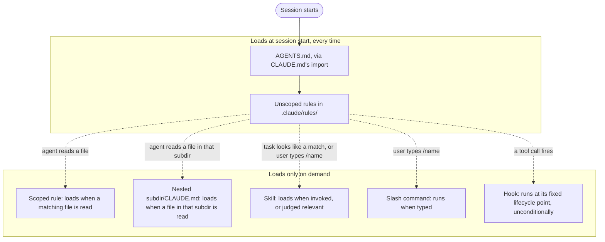

# Orientation

This is the starting point if you have never used an AI coding agent before. It defines
the vocabulary the rest of this repo's docs assume, then shows what `agent-harness`
specifically adds on top of that vocabulary. Read it once before [`docs/getting-started.md`](getting-started.md).

## What a session is

A session is one continuous run of the agent: you open it, exchange messages and tool
calls with it, and at some point it ends (you close the terminal, you run `/clear`, or
you start a new one). Everything that happens inside a session lives together in one
place, called the context window, covered below. Nothing from a previous session
carries into a new one automatically. If a decision only exists as a sentence typed in
yesterday's session, it is gone today unless something wrote it to a file.

## What a prompt is

A prompt is the text you send the agent in a given turn: an instruction, a question, a
task description. The agent also receives standing instructions it did not ask for
(covered in the next section), so what the model actually sees on any turn is your
prompt plus everything that loaded before it.

## What the agent can see: the context window

Everything the model can act on for a given turn sits in one fixed-size space called the
context window: your prompt, the conversation so far, every file the agent has read, and
every standing instruction that loaded at launch. There is no separate memory outside
that window. If something is not in it, the model cannot see it, no matter how obviously
true or recently discussed it is.

Two things follow from this that surprise most new users. First, splitting one
instruction file into several files that import each other does not reduce what a
session loads: an import pulls the imported file in at launch, in full, so the total
cost is the same either way. Second, the model's adherence to any single instruction
measurably drops as the total volume of context grows, so a session that has loaded
3,000 lines of standing instructions has less attention left for your actual question
than one that loaded 200. Full detail, including what to do about both, lives in
[`docs/context-window-management.md`](context-window-management.md).

## What a tool call is

A tool call is the agent doing something other than talking: reading a file, running a
shell command, editing a line, dispatching another agent. Each tool call and its result
also lands in the context window, which is why a long session that reads many large
files can fill its window without a single word of conversation.

## Why it forgets

An agent forgets in exactly three ways, and they are different actions with different
consequences:

- **Clear.** Ends the session and starts a fresh context window with nothing carried
  over except whatever loads at launch (see the table below).
- **Compact.** Replaces the conversation so far with a summary, to make room in a
  session that is filling up, while keeping the session nominally continuous. Detail
  not in the summary is gone the same way it would be after a clear.
- **Starting a new session.** The same as a clear, just phrased as beginning rather than
  ending: a new terminal, a new working directory, a new day.

None of the three preserve anything that was only ever spoken in the conversation. If
you want a decision, a plan, or a piece of state to survive one of these, it has to be
written to a file before the moment it happens, not summarized after. This is also why
this repo has a firm rule that recommending or performing a clear, a compact, or a new
session without producing a copy-pasteable resume prompt is not a complete handoff. See
[`docs/handoff-and-resume.md`](handoff-and-resume.md) for the mechanics.

## What this harness adds

Plain agent use is a session, a prompt, and whatever the model already knows. This
harness adds five mechanisms on top of that, each one defined here before the row that
uses it:

| Mechanism | What it is | Loads or runs |
|---|---|---|
| Instruction file | A Markdown file such as `AGENTS.md` or `CLAUDE.md` that the model reads as plain text and is expected, but not forced, to follow | Every session, at launch, with no invocation step |
| Rule | An instruction file under `.claude/rules/`, optionally scoped to a `paths:` glob so it only loads for files matching that pattern | Every session if unscoped, or only when the agent reads a matching file |
| Skill | A directory at `skills/<name>/` with a `SKILL.md` describing a multi-step procedure the agent can follow | When invoked by typing `/<name>`, or when the harness judges the task matches it |
| Slash command | A Markdown file in `commands/` that a user types deliberately to kick off one specific flow | Only when someone types `/<command-name>` |
| Hook | A shell script wired into Claude Code's own lifecycle (for example before every subagent spawn) that runs as code, not as an instruction the model can decide to skip | Unconditionally, at the lifecycle point it is registered for |

The distinction that matters most among these: an instruction file, a rule, and a skill
are all text the model reads and can, under enough pressure, drift from. A hook is a
script that runs regardless of what the model is thinking, and its exit code can block
an action outright. If a rule must hold with no exceptions, it needs a hook, not a
paragraph. [`docs/choosing-your-tools.md`](choosing-your-tools.md) walks through all six mechanisms (it also
covers subagents) in the same order, with worked examples from this repo.

## What loads at session start versus on demand

This diagram follows the "Loads when" column of the mechanism table in `CLAUDE.md`
(the row for each mechanism, `CLAUDE.md` ("Context discipline") through `CLAUDE.md` ("Context discipline")):

The always-on core is deliberately kept small, because everything in it is a fixed cost
paid by every session whether or not that session needs it. Everything situational is
pushed into one of the on-demand mechanisms instead.

## Exercise: check what actually loaded

Start a session in a repository where `harness init` has already run, and ask the agent
a direct question: "Which instruction files did you load for this session, and how did
you reach each one?"

**What you should see:** the agent names `AGENTS.md`, and says it reached that file
through `CLAUDE.md`'s import line rather than reading `AGENTS.md` directly. It may also
name any unscoped rules under `.claude/rules/` if the project has them.

**What it means if you do not see this:** if the agent cannot name `AGENTS.md` at all,
either `harness init` was not actually run in that repository, or the file was moved or
deleted after init. If the agent claims to have loaded a scoped rule or a skill it was
never asked about and no matching file was read, that is a sign the model is guessing
rather than reporting, and you should not trust its other self-reports about what
loaded without checking the files directly.
