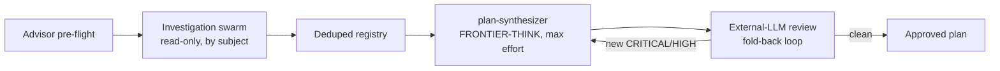

# Planning and executing a large build

## Contents

- [Before you read this](#before-you-read-this)
- [Scope first, or the plan will improve dead code](#scope-first-or-the-plan-will-improve-dead-code)
- [Writing the plan](#writing-the-plan)
- [Why a plan needs a review from outside its own model family](#why-a-plan-needs-a-review-from-outside-its-own-model-family)
- [What a good phase looks like](#what-a-good-phase-looks-like)
- [The model and effort matrix, and why it travels with the phase](#the-model-and-effort-matrix-and-why-it-travels-with-the-phase)
- [The nested phase-directory pattern](#the-nested-phase-directory-pattern)
- [Checking status without re-reading the whole plan](#checking-status-without-re-reading-the-whole-plan)

## Before you read this

This document assumes you already know three things [`docs/glossary.md`](glossary.md) defines:
[`advisor`](glossary.md#advisor), the host's built-in
[`Plan` subagent](glossary.md#the-host-built-in-subagent-types-plan-explore-general-purpose), and
[the Workflow tool](glossary.md#the-workflow-tool). If your tool has no Workflow equivalent, the
answer to "Workflow or subagents" below is always subagents.

This article also describes an optional external second-opinion review step. That step requires
one of several third-party CLIs (`skills/external-llm-review/SKILL.md` ("External LLM Review (independent second opinion, fold-back loop)") names codex,
cursor-agent, and gemini) installed and authenticated on your machine. If you do not have one of
those set up, that step does not apply to you, and the gate is the rest of the stack: the test
command, the `adversary` agent, `/ponytail-review`, re-running the tests, and merging. Do not treat the
external review step as required; it is a strengthening step, not a floor.

An agent session does not survive a large build. Context fills up, gets compacted, or the session
ends and a new one starts with none of the previous one's memory. If the plan for a multi-day
change lives only in a chat transcript, it is gone the moment that transcript rotates out of
context. The plan has to be a file on disk, written before any code changes, because the file is
the only thing guaranteed to still exist when the next session picks up the work.

This matters more as a build gets bigger. A five-minute fix can live entirely in one session's
head. A build that spans phases, multiple agents, and more than one sitting needs a document that
carries intent forward: what is being built, why, in what order, and how anyone (or any agent)
resuming later will know what is done and what is not. That document is the plan, and everything
in this article is about producing one that actually holds up across sessions instead of decaying
into a to-do list nobody trusts.

## Scope first, or the plan will improve dead code

Before any planning, run the `scope-audit` skill. Its premise is specific: review checks whether a
requirement is correct, not whether the thing it targets is alive. Those are different questions,
and a plan built without answering the second one will confidently improve surface nobody uses.

The skill's own worked example is blunt about the cost of skipping this. A 2,695-line plan survived
32 review rounds and an approval, and roughly half of it turned out to target inherited surface the
operator had never run, including a phase to harden a batch runner whose log directory held nothing
but a `.gitkeep` file. Execution then spent real hours hardening a control whose only purpose was
pausing a component that a different part of the same plan existed to retire. Every individual
requirement in that plan was well-argued. None of the reviewers asked whether the subject matter
was alive, because that is not the question review answers.

`scope-audit` answers it with evidence instead of documentation. It looks for runtime residue: a
history file a feature writes only if it actually ran, a log directory with real logs in it rather
than just a placeholder, a config file that has to exist before a feature can be configured at all.
Absence of a feature's run-history artifact and its config file together is a stronger signal than
either alone: it means the feature is unconfigured and cannot currently run, rather than merely
idle. The skill also traces reachability transitively (a file reached only through another
orphaned file is itself an orphan) and checks whether a proposed guard is already enforced
structurally before anyone writes a rule for it.

The output is a durable `IN SCOPE` / `OUT OF SCOPE` document, and the governing rule that comes out
of it is short: a plan phase earns its place only if it touches something on the `IN SCOPE` list.
Work aimed at `OUT OF SCOPE` surface is inherited maintenance, not improvement, no matter how well
the plan argues for it. Carry that document into every later stage: the investigation swarm should
not be dispatched at dead surface, the synthesis step should be told to justify any phase touching
it, and both review layers should test each phase against it.

Scope audits also surface premises, not just usage. A requirement rests on something being true;
premises rot over time, and the same failure mode that hits usage (nobody re-checks it) hits
premises too. Note this: unused surface is not necessarily dead forever. Say explicitly what
condition would revive it, because deleting effort from a plan is not the same as deleting code.

## Writing the plan

With scope established, the actual planning happens through `/deep-plan` for a small, single-area
change, or the `deep-plan-swarm` skill for anything that spans many files or subsystems, where an
unexamined planning error would be expensive.

| Step | `/deep-plan` | `deep-plan-swarm` |
|---|---|---|
| Scope gate | already run above, once | runs its own scope gate before investigation fans out |
| Advisor pre-flight | yes, on the raw request, before any plan exists | yes, same pre-flight, feeds the investigation framing too |
| Investigation | none | read-only agents grouped by subject (plans and handoffs, scripts, tests and CI, config and assets, external artifacts) map the problem space first |
| Synthesis | `Plan` subagent, FRONTIER-THINK tier | `plan-synthesizer` agent, FRONTIER-THINK tier, max effort, reconciling the investigation registry plus any prior plans being merged |
| Critique | advisor, second pass, on the finished plan | same advisor critique, plus external-LLM review below |
| External review | not part of the flow | `codex` (default), `cursor-agent`, or `gemini`, fold-back loop until no new CRITICAL/HIGH finding |
| Output | four-part plan: execution shape, Workflow-vs-agents verdict, model/effort matrix, phases | same four-part shape, plus an AUTORUN mission section and a verification section |

Investigation scales with scope: ten to twenty groups for a full audit, three to five for a
targeted merge where investigation material already exists. Every swarm member cites an absolute
path for every claim, classifies findings as superseded/stale, unexecuted, placeholder,
load-bearing, or risky if moved, and marks low confidence explicitly; the raw reports get deduped
into one registry before the synthesizer sees them, because swarm reports contain errors that need
first-hand verification before anything gets built on them. The synthesizer is deliberately
read-only (it may run `git log`, `grep`, or a read-only test runner to verify a claim, but never
edits or commits) and decides disagreements with a stated reason rather than passing both through.



Where a reviewer CLI is available the external review step is not interchangeable with another
Claude-run advisor pass, and where none is available the step is skipped and recorded as skipped
rather than replaced by one. That is the distinction the note at the top of this article draws, and
the reasoning is in the next section.

## Why a plan needs a review from outside its own model family

`deep-plan`'s advisor critique and `deep-plan-swarm`'s external-LLM review sound like they do the
same job. They do not, and the difference is the entire reason the swarm skill adds a second layer
instead of just running the advisor twice.

A Claude-based reviewer, even a strong one, shares blind spots with the Claude model that wrote the
plan in the first place. The `external-llm-review` skill states this directly: a different model
family catches defects that a same-family review misses, and a Claude reviewer is never treated as
a substitute for it. The skill also documents evidence for this from actual review disagreements.
In one case, an external reviewer found a blocker the internal adversarial reviewer had missed
entirely: a second chokepoint carrying the same defect a previous fix round had just closed
elsewhere. In another, the internal reviewer found something the external one missed. Neither
reviewer is a superset of the other, so both get folded into one fix brief; skipping either because
the other came back clean throws away exactly the coverage the second layer exists to provide.

The skill is also specific about what counts as a real review versus a review that only looks like
one. A gate closes only when the reviewer's process exits 0, produces substantial output, and its
first line is a `VERDICT:` marker followed by a severity-ranked findings block if any were found.
An empty response, a one-byte file, JSON metadata with no verdict text, or a CLI narrating "filing
the defects..." while doing nothing are all failed rounds, not clean ones, and treating them as
clean is exactly the trap the skill is written to prevent (see `autorun-hitl-heartbeat.md` for the
harness-level traps that produce this kind of fake-clean result).

The review is a fold-back loop, not a single pass: findings get verified first-hand, the reviewer's
CRITICAL and HIGH items get fixed, and the same artifact goes back for another round. There is no
round cap. The loop ends when a round returns no new CRITICAL or HIGH finding, not after some fixed
number of tries; a fixed cap would let review stop before it converges just because a counter ran
out.

## What a good phase looks like

`templates/phase/a-example-phase/CLAUDE.md` and its sibling task file are the harness's worked
example of a phase, and they are short on purpose. A phase needs four things: a goal, a
machine-checkable "done when" condition, verification steps, and a rollback.

The goal is one paragraph stating what the phase produces and, more importantly, what risk it
retires. The template's own instruction is explicit about this framing: state the risk the phase
retires, not the steps to retire it, because the steps belong in the task files underneath it, not
in the phase-level summary that stays in context.

The "done when" condition is where most of the value sits, and the template states the rule as
plainly as the harness ever states anything: a machine-checkable condition is a script that asserts
it and exits non-zero if unmet. An autonomous loop is only worth wiring at all when the acceptance
signal is machine-checkable, never model-self-reported.

This has to be true, not merely convenient: a model reporting "tests pass" is a claim, not a fact.
Nothing stops that claim from being wrong: a test that never ran, a green result from the wrong
tree, a check that measures something adjacent to the real requirement. A script that asserts and
exits non-zero cannot make that mistake in the same way, because its output is a fact about the
filesystem or the process, not a summary a model produced about its own work.
The `autorun-plan` skill's execution rules carry this same principle forward at build time: a
subagent's "tests pass" is treated as a claim, and the orchestrator re-runs the check itself before
trusting it. If the acceptance criterion were self-reported instead of scripted, there would be
nothing independent left to re-run.

This is also why "done when" has to be a script and not a description of a desired end state. A
description can be satisfied by several different real states, some of which are wrong; a script
either exits zero on the actual filesystem or it does not. The gap between those two is where a
silently broken phase gets marked complete and stays that way until someone notices much later, at
a much higher cost to trace back.

Each individual task file (`01-first-task.md` in the template) carries the same shape at a smaller
grain: goal, steps, verification with the exact command and expected output, and a rollback
describing how to undo the task if it goes wrong. The rollback line matters even for phases that
feel safe, because "how do I undo this" is a much cheaper question to answer before a change lands
than after something downstream depends on it.

## The model and effort matrix, and why it travels with the phase

Every plan produced by `/deep-plan` or `deep-plan-swarm` carries a per-phase model and effort
matrix, presented as a table and, separately, injected inline into every phase's own heading. The
`plan-synthesizer` agent definition gives the exact shape: something like `### Phase 1A - Foo
[agent: exec-critical, model: FRONTIER-DO, effort: high]` rather than a table row that lives only at
the top of the document.

The duplication is deliberate, not sloppy. A phase heading gets lifted out of its original document
constantly: copied into a task tracker, pasted into a new session's prompt, handed to a subagent
that never sees the rest of the plan. If the model and effort setting only exists in a table at the
top of the file, all of those copies lose it, and the phase gets executed at whatever model the
new context happens to default to, which is exactly the "silent inheritance" failure the harness's
model-tiering rules exist to prevent. Putting the setting in the heading itself means the setting
travels wherever the heading travels.

The matrix names a tier, never a specific model, because `config/models.conf` is the one place
tiers bind to actual model names, and a plan that hardcodes a model name breaks the first time the
roster changes. The tiers themselves are defined by what kind of mistake they are meant to survive:
mechanical and fully specified work that a test can prove goes to the smallest tier; well-bounded
implementation against a pattern already in the repo goes to the middle tier; anything
correctness-critical, or anything where a silent wrong answer is expensive, goes to a top tier at
high or max effort; and adversarial review of that top-tier work sits at or above the tier that
produced it, because a cheaper reviewer cannot see mistakes a more capable model made.

## The nested phase-directory pattern

`templates/phase/` is the harness's worked example of a structural trick for keeping a large plan
out of context until it is actually needed. The shape on disk is:

```
templates/phase/
├── CLAUDE.md
└── a-example-phase/
    ├── CLAUDE.md
    └── 01-first-task.md
```

The top-level `templates/phase/CLAUDE.md` is short: a one-line explanation of the pattern, plus a
status table listing every phase directory and its current status.

```markdown
# Phases

Status index for this build. Each phase directory holds its own `CLAUDE.md` with just that
phase's status and task table, so it stays out of context until work happens in that directory.

| Phase | Status |
|---|---|
| [a-example-phase](a-example-phase/) | PENDING |

Statuses: PENDING, IN PROGRESS, COMPLETE, BLOCKED.
```

Each phase's own `a-example-phase/CLAUDE.md` carries that phase's detail: the one-paragraph goal,
its own status, its own task table, and its "done when" condition.

```markdown
# Phase A: Example

One paragraph on what this phase achieves and why it exists. State the risk it retires, not the
steps. Keep this file short: it is loaded whenever the agent touches a file in this directory.

## Status: PENDING

| Task | Status |
|---|---|

| [01-first-task](01-first-task.md) | PENDING |

## Done when

A machine-checkable condition. A script asserts it and exits non-zero if unmet. An autonomous
loop is only worth wiring when the acceptance signal is machine-checkable, never model-self-reported.
```

And the task file underneath it carries the smallest grain of detail: goal, steps, verification
command and expected output, rollback.

The payoff is a fact about how coding agents load context, covered in more depth in
`context-window-management.md`: a nested `CLAUDE.md` loads only when the agent reads or edits a
file in that same directory, not at session launch. A top-level plan document with fifty inline
phases loads every phase's detail into every session regardless of which phase is active. The
nested pattern instead keeps a short index in context at all times (the top-level file, one line
per phase) and loads a phase's full detail only for the session actually working inside that
phase's directory. A build with twenty phases carries roughly the cost of one phase's worth of
detail in context at a time, not twenty.

This only works if the top-level file stays short. The moment someone starts pasting task detail
into the top-level status table instead of linking to the phase directory, the pattern collapses
back into a single always-loaded document, just split across more files.

## Checking status without re-reading the whole plan

Two commands read the nested phase structure without requiring anyone to open every file by hand.

`/phase-status` scans every `CLAUDE.md` and task file under `phases/` and renders a completion
matrix: each phase, its task list with a checkmark or in-progress marker per task, and a total
count of completed tasks against the whole build. It answers "where are we" at a glance, and it
answers it by reading the actual status fields on disk rather than by asking an agent to recall
what it remembers doing.

`/next-step` answers a narrower question: what should happen right now. It scans phase directories
in order, finds the first task marked `IN PROGRESS` (preferred) or `PENDING`, and presents its
phase and purpose, the task's file path and title, its current status, what prerequisites it
depends on, the exact commands to run from the task file, and any open rows from
`.project-state/ERRORS.md`. If a task
is already `IN PROGRESS`, it also shows what has been done on it so far and what remains, so a
session resuming mid-task does not have to reconstruct that from git history.

Both commands depend entirely on the phase files being accurate and current. They are cheap to run
precisely because they read structured status fields instead of re-deriving progress from a full
plan document, which is the entire point of writing "done when" as a script and status as a field
in the first place: the state is legible to a command, not just to the agent that last touched it.
