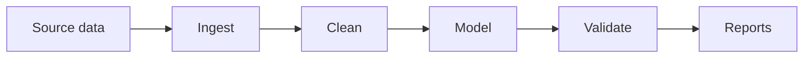

# project-name

> One-sentence pitch. What question does this answer, who is it for.

## Why this exists

[2–3 sentences: the analytical question, the audience, what's novel about the approach.]

## Dataset

| Property | Value |
|---|---|
| Source | [Provider] – [URL] |
| Size | [N rows, M columns, X GB on disk] |
| Format | Parquet / CSV / DuckDB |
| Time range | YYYY-MM-DD to YYYY-MM-DD |
| Update cadence | [daily / weekly / static] |
| License | [Data license — may differ from code license] |

## Methodology

[2–4 paragraphs explaining the approach: data cleaning, modeling choices, validation strategy. Reference any non-obvious tradeoffs.]

## Results

| Metric | Value | Notes |
|---|---|---|
| [Key metric A] | … | … |
| [Key metric B] | … | … |
| [Comparison vs baseline] | … | … |

[Optional: a chart image or link to a notebook.]

## Reproducibility

**Prerequisites:** Docker, ~10 GB disk.

```bash
git clone https://github.com/USER/REPO
cd REPO
docker compose up -d
make all
```

This regenerates all results in ~15 minutes on a 2023 laptop.

### Per-step

```bash
make download     # fetch raw data
make clean        # parse + clean
make model        # run model
make report       # generate report figures
```

## Architecture



[1–2 sentences interpreting the flow.]

## Data dictionary

| Column | Type | Description |
|---|---|---|
| `user_id` | string | Anonymized user identifier. |
| `event_ts` | timestamp | Event time in UTC. |
| […] | […] | […] |

## Assumptions & tradeoffs

- **Assumption A:** [What we assumed, why, how it affects results.]
- **Tradeoff B:** [What we considered, what we chose, what we gave up.]
- **Known limitation C:** [What's not handled and why.]

## Validation

[How correctness was verified: reconciliation against a known total, sanity checks, statistical tests, comparison with prior work.]

```bash
make validate
```

## Future work

- [Improvement A — what + estimated lift.]
- [Improvement B.]

## License

- Code: [MIT](LICENSE)
- Data: [provider's license — link]
- Reports / figures: CC-BY 4.0

## Acknowledgments

- [Data provider]
- [Prior work this builds on]
- [Reviewers]
