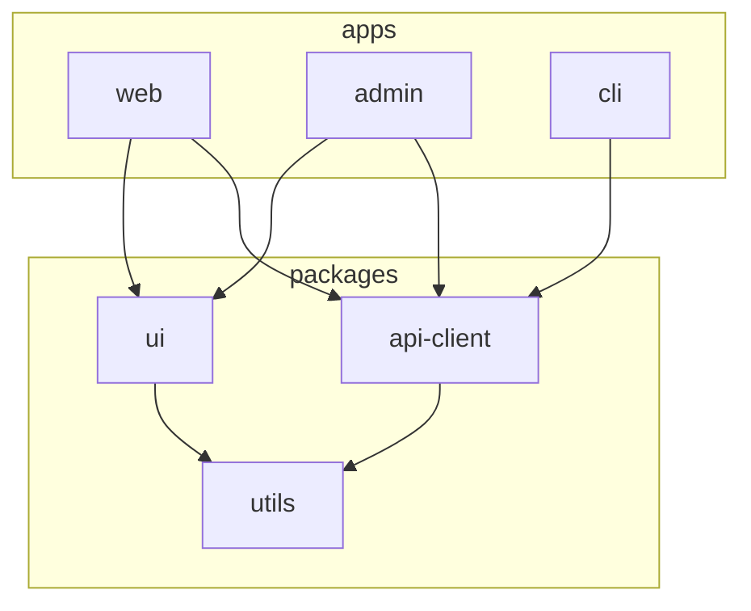

# project-name

> One-sentence pitch. What the workspace contains, who maintains it.

[](https://github.com/USER/REPO/actions)
[](LICENSE)

## Why this exists

[2–3 sentences explaining what the workspace organizes and why a monorepo (vs. polyrepo).]

## Workspace structure

```
packages/          ← reusable libraries published externally
  ui/              ← shared component library
  api-client/      ← typed SDK for our backend
  utils/           ← framework-agnostic helpers
apps/              ← deployable products
  web/             ← marketing site (Next.js)
  admin/           ← internal dashboard (Vite)
  cli/             ← developer CLI (Node)
tools/             ← repo-internal build / lint tooling
docs/              ← cross-cutting documentation
```

### Why this shape

- `packages/` are versioned and published — anyone outside this org can consume them.
- `apps/` are private deployables, never published as packages.
- `tools/` are internal-only build helpers; not consumed by `packages/` or `apps/`.
- A utility lives in `packages/utils/` only if shared by ≥2 apps; one-app-only utilities stay in that app.

## Setup

**Prerequisites:** Node 20+, pnpm 9+.

```bash
git clone https://github.com/USER/REPO
cd REPO
pnpm install
```

This installs dependencies across all packages and apps.

## Common commands

| Command | What it does |
|---|---|
| `pnpm dev` | Run all apps in watch mode. |
| `pnpm build` | Build everything in dependency order. |
| `pnpm test` | Run all package + app tests. |
| `pnpm lint` | Lint the whole workspace. |
| `pnpm --filter <pkg> <cmd>` | Run a command in one package. |

## Per-package READMEs

- [packages/ui](packages/ui/README.md)
- [packages/api-client](packages/api-client/README.md)
- [packages/utils](packages/utils/README.md)
- [apps/web](apps/web/README.md)
- [apps/admin](apps/admin/README.md)
- [apps/cli](apps/cli/README.md)

## Dependency management

- **Workspace-only deps** (devtools, linters, type-checkers) live in the root `package.json`.
- **Per-package runtime deps** live in that package's `package.json`.
- Cross-package deps use `workspace:*` protocol — pnpm resolves to local sources during development and to published versions at build time.

## Release process

We use [changesets](https://github.com/changesets/changesets):

```bash
pnpm changeset       # create a changeset describing your change
git add . && git commit -m "feat: ..."
# CI on merge handles version bumps + publishing.
```

## Architecture



Apps consume packages. Packages depend on packages (with no cycles). Apps never depend on apps.

## Contributing

See [CONTRIBUTING.md](CONTRIBUTING.md).

## License

[MIT](LICENSE) © 2026 Your Name
