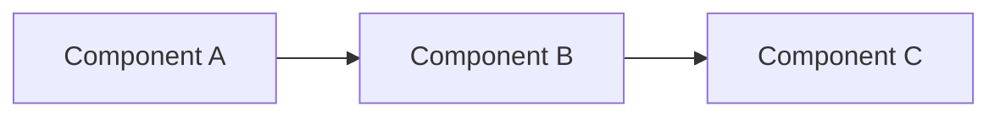

# project-name

> One-sentence pitch. What it is, what problem it explores.

**🌐 [Live demo](https://your-project.example.com)**


## What this is

[2–4 sentences: the problem, your motivation for building it, what you wanted to learn or demonstrate.]

## Tech stack

- [Framework / library 1]
- [Framework / library 2]
- [Hosting]

## Key features

| Feature | Notes |
|---|---|
| [Feature A] | [Brief detail about what makes it interesting.] |
| [Feature B] | […] |
| [Feature C] | […] |

## How it works

[2–3 paragraphs explaining the architecture or key technical choices. Diagrams welcome if helpful.]



## Run locally

```bash
git clone https://github.com/USER/REPO
cd REPO
npm install
npm run dev
```

Open http://localhost:3000.

## What I learned

[3–5 honest reflections. What surprised you, what you'd reconsider, what tradeoffs you made knowingly.]

- [Insight A]
- [Insight B]
- [Tradeoff C — what you chose and why]

## Future work

- [What you'd add next, time permitting.]

## Author

[Your name] — [portfolio link] • [LinkedIn] • [other notable work]

## License

[MIT](LICENSE) © 2026 [Your Name]
