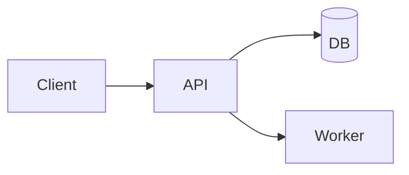

# Take-home: [project name / role]

> Submission by [Your Name] for [Company] [Role]. [One-sentence framing of what you built.]

## Summary

[2–4 sentences: what you built, what problem the prompt asked you to solve, and your approach in brief.]

## How to run

**Prerequisites:** [Docker / Node 20+ / Python 3.11+ — whatever's required].

```bash
git clone <repo>
cd <repo>
docker compose up
```

Open http://localhost:3000.

### Without Docker

```bash
npm install
npm run setup
npm start
```

### Run tests

```bash
npm test
```

## Assumptions

I made these assumptions in the absence of further clarification:

- [Assumption 1 — what + why.]
- [Assumption 2.]
- [Assumption 3.]

[Add a sentence on whether you'd change any if you had a chance to ask follow-up questions.]

## Tradeoffs

- **[Tradeoff topic A]:** considered [option X] and [option Y]. Chose [Y] because [reason]. The tradeoff is [downside].
- **[Tradeoff topic B]:** […]
- **[Tradeoff topic C]:** […]

## Architecture



[Brief explanation: 2–3 sentences.]

## Key decisions

| Decision | Choice | Reasoning |
|---|---|---|
| [Decision A] | [What] | [Why] |
| [Decision B] | [What] | [Why] |
| [Decision C] | [What] | [Why] |

## Validation

[How you verified correctness: tests, reconciliation, manual smoke checks.]

## What I'd do differently

Given more time, I would:

- [Improvement A — why it would matter.]
- [Improvement B.]
- [Improvement C.]

## Out of scope

The prompt asked for [X, Y, Z]. I deferred:

- **[Item A]:** [reason — usually time-boxed scope].
- **[Item B]:** [reason].

## Author

[Your Name] • [email] • [LinkedIn or portfolio]
