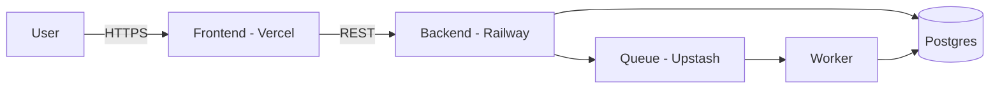

# project-name

> One-sentence pitch. What does it do, who is it for.

**🌐 [Live demo](https://your-demo.example.com)** • [Documentation](docs/) • [Report a bug](https://github.com/USER/REPO/issues)


[](https://github.com/USER/REPO/actions)
[](https://app.netlify.com/sites/SITE/deploys)
[](LICENSE)

## Why this exists

[2–3 sentences: problem solved, what differentiates it.]

## Tech stack

| Layer | Technology |
|---|---|
| Frontend | React 18 + Vite |
| Styling | Tailwind CSS |
| State | TanStack Query + Zustand |
| Backend | Node 20 + Fastify |
| Database | Postgres 16 |
| Hosting | Vercel (frontend) + Railway (backend) |

## Features

| Feature | Status |
|---|---|
| Real-time collaboration | ✅ Stable |
| Offline mode | 🚧 In progress |
| Mobile responsive | ✅ |
| Dark mode | ✅ |
| i18n | 📅 Planned |

## Run locally

**Prerequisites:** Node 20+, pnpm, Docker (for Postgres).

```bash
git clone https://github.com/USER/REPO
cd REPO
pnpm install
cp .env.example .env       # fill in DATABASE_URL, etc.
docker compose up -d       # starts Postgres
pnpm dev
```

Open http://localhost:3000.

## Deploy

### Vercel

[](https://vercel.com/new/clone?repository-url=https://github.com/USER/REPO)

### Netlify

[](https://app.netlify.com/start/deploy?repository=https://github.com/USER/REPO)

## Architecture



Frontend talks to backend over REST. Long-running jobs go through a queue worker. Database is the single source of truth.

## Project structure

```
src/
├── app/          ← routes (file-based)
├── components/   ← shared UI
├── lib/          ← utilities, hooks, API client
└── styles/       ← Tailwind config + globals
```

## Contributing

Issues and PRs welcome.

```bash
pnpm test
pnpm lint
pnpm build
```

## License

[MIT](LICENSE) © 2026 Your Name
