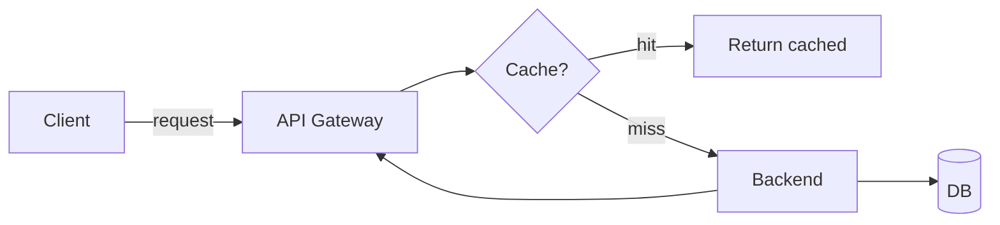

# GitHub-Specific Markdown Features

Features that render on GitHub and elevate a README above plain CommonMark. Use deliberately.

## GitHub Alerts

Five severity levels. Render as colored callout boxes on GitHub.

```markdown
> [!NOTE]
> Highlights information that users should know, even when skimming.

> [!TIP]
> Optional information to help a user be more successful.

> [!IMPORTANT]
> Crucial information necessary to achieve the user's goal.

> [!WARNING]
> Critical content demanding immediate user attention to avoid problems.

> [!CAUTION]
> Negative potential consequences of an action.
```

**When to use:**
- `NOTE` — version compatibility, platform caveat, common-question answer.
- `TIP` — performance hint, recommended option, "you may also want X".
- `IMPORTANT` — required step the reader will skip if they're not looking (e.g., post-install config).
- `WARNING` — possible breakage if ignored.
- `CAUTION` — potential data loss / irreversibility.

**Don't:** stack multiple alerts back-to-back. Don't use as decoration.

## Collapsible sections

```markdown
<details>
<summary>Click to expand: Windows install instructions</summary>

```powershell
choco install tool
```

Add `C:\Program Files\tool` to PATH manually if not set.

</details>
```

**When to use:**
- OS-specific install variants (one default visible, others collapsed).
- Full API tables when the README primarily targets the quick-start reader.
- Troubleshooting / FAQ.
- Multiple screenshots (show one inline, collapse the gallery).
- Advanced configuration when most users want defaults.

**Rules:** Always put a useful `<summary>`. Don't collapse essential content. Confirm the closing `</details>` exists — broken tags swallow the rest of the README.

## Mermaid diagrams

````markdown

````

**Supported diagram types:**
- `flowchart` (most common for architecture)
- `sequenceDiagram` (request flows, protocol exchanges)
- `classDiagram` (object model)
- `stateDiagram-v2` (state machines)
- `erDiagram` (entity-relationship)
- `gantt` (timelines, project planning)
- `pie` (small distributions)

**When to use:**
- ≥3 components or steps to explain.
- Sequence of API calls or async flows.
- State transitions.

**When NOT to use:**
- 2-node diagrams (just write a sentence).
- Diagrams that don't render mentally on a phone screen.
- Decoration.

**Always pair with prose.** Screen readers can't read Mermaid output. A 1–2 sentence summary makes the diagram interpretable without sight.

## GFM tables

```markdown
| Feature | Description | Status |
|---|---|---|
| Real-time sync | Collaborate without delay | ✅ Stable |
| Offline mode | Work without internet | 🚧 In progress |
| Mobile app | iOS + Android | 📅 Planned Q3 |
```

**When to use:**
- Feature lists (convert from bullet lists for scannability).
- API parameter / option reference.
- Compatibility matrices.
- Comparison with alternatives.

**Don't:** use tables for content with very different cell-length variance — looks ragged.

## GFM task lists

```markdown
## Roadmap

- [x] Core API
- [x] TypeScript types
- [ ] CLI wrapper
- [ ] Browser bundle
- [ ] React adapter
```

**When to use:** explicit, public-facing roadmaps. Otherwise prefer GitHub Projects.

## Anchor-linked TOC

GitHub auto-renders an Outline button (top-right of README) from H2/H3 headings. Manual TOC is optional but signals organization for files >150 lines.

```markdown
## Contents

- [Why this exists](#why-this-exists)
- [Install](#install)
- [Usage](#usage)
- [API](#api)
  - [`functionA()`](#functiona)
  - [`functionB()`](#functionb)
```

**Anchor format rules:**
- Lowercase the heading text.
- Replace spaces with hyphens.
- Strip punctuation: `## API Reference` → `#api-reference`.
- Strip backticks: ` ### `getUser()` ` → `#getuser`.
- Numbers stay: `### Step 1` → `#step-1`.

Custom anchors via HTML:

```markdown
<a id="custom-anchor"></a>
## Heading That Won't Match Naturally
```

## Footnotes

```markdown
This claim relies on benchmark data[^1].

[^1]: See https://example.com/benchmarks for methodology.
```

**When to use:** citing external claims, performance numbers, statistics, attribution. Keeps the main flow clean.

## Emoji shortcodes

GitHub renders `:rocket:` as 🚀. Examples: `:warning:`, `:tada:`, `:bug:`, `:gear:`, `:zap:`.

**When to use:** sparingly. Status indicators (✅ / ❌ / 🚧) help scannability. Excessive use ("🎉🚀✨🔥") signals hype.

## Code fence languages

Always tag the language:

````markdown
```bash
npm install
```

```ts
const x: number = 42
```

```diff
- old line
+ new line
```
````

Special tags worth knowing:
- `mermaid` — diagrams (see above).
- `diff` — green/red highlight for changes.
- `console` / `sh` — shell with prompt-aware highlighting in some renderers.
- `text` / `none` — disable highlighting (use for ASCII art, logs).

## Truncation limits

- README files are truncated at 500 KiB.
- Single Markdown files: 1 MB hard limit.
- If approaching, move depth to `docs/` and link.
