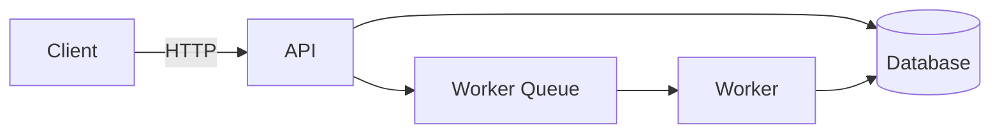

# Section Templates

Canonical section scaffolds with filled examples. Pull the relevant one when drafting in Stage 2.

## Title + Tagline

```markdown
# project-name

> One-sentence pitch that tells me what this does AND why I should care.
```

Tagline rules: ≤15 words, includes a noun (what it is) + verb (what it does for me), no buzzwords.

## Hook / Description (the first paragraph)

```markdown
project-name is a [category] for [audience] that [primary benefit]. Unlike [alternative], it [differentiator]. Built because [origin reason].
```

Three sentences, three jobs: position, differentiate, motivate. Skip "blazing fast" / "easy to use" — show, don't tell.

## Badges row

```markdown
[](https://github.com/USER/REPO/actions)
[](https://codecov.io/gh/USER/REPO)
[](https://www.npmjs.com/package/PACKAGE)
[](https://www.npmjs.com/package/PACKAGE)
[](LICENSE)
```

Group order: trust (CI, coverage) → adoption (version, downloads) → license. See `badges-cheatsheet.md` for full taxonomy.

## Table of Contents (manual)

```markdown
## Contents

- [Why this exists](#why-this-exists)
- [Install](#install)
- [Quick start](#quick-start)
- [API](#api)
  - [`functionA`](#functiona)
  - [`functionB`](#functionb)
- [Examples](#examples)
- [Contributing](#contributing)
- [License](#license)
```

Anchors are lowercase + hyphens. GitHub auto-renders an Outline button; manual TOCs are optional but signal organization for files >150 lines.

## Install

````markdown
## Install

```bash
# npm
npm install @org/package

# pnpm
pnpm add @org/package

# yarn
yarn add @org/package
```

Requires Node 18+.
````

Show all package managers your audience uses. Always tag the code fence with `bash` / `shell` / language. Always state minimum runtime versions.

## Quick start / Usage

````markdown
## Quick start

```ts
import { greet } from '@org/package'

console.log(greet('world'))
// → "Hello, world"
```
````

Smallest working example. Show expected output as a comment OR in a separate code fence. Test the example in CI to prevent drift.

## API reference

````markdown
## API

### `greet(name: string, options?: GreetOptions): string`

Returns a greeting for the given name.

- `name` — the recipient. Required.
- `options.formal` — if true, returns "Good day, NAME". Default: false.

```ts
greet('Ada')                   // → "Hello, Ada"
greet('Ada', { formal: true }) // → "Good day, Ada"
```
````

Each entry: signature → 1-sentence purpose → parameters → minimal example. Group by surface area; link from TOC.

## Command reference (CLI)

```markdown
## Commands

| Command | Description |
|---|---|
| `tool init` | Create a new project. |
| `tool build` | Compile sources. |
| `tool deploy` | Push to remote. |

<details><summary>Global flags</summary>

- `--config <path>` — config file path. Default: `./tool.config.yml`.
- `--verbose` — print debug info.
- `--quiet` — suppress non-error output.

</details>
```

## Examples

````markdown
## Examples

### Use case 1: <real-world scenario>

<2 sentences of context.>

```ts
// minimal but realistic code
```

### Use case 2: <integration with X>

<context>

```ts
// code
```
````

2–3 examples max. Each anchored to a real pattern a user would actually have. No "foo bar baz" placeholders.

## Architecture (with Mermaid)

````markdown
## Architecture



Brief description of the flow. Note any non-obvious choices (e.g., "writes are synchronous; reads can be eventual").
````

Use Mermaid when ≥3 components or steps. Always pair with 1–2 sentences of prose so the diagram is interpretable on a screen reader.

## Contributing

```markdown
## Contributing

Issues and PRs welcome. Before submitting:

1. Run the test suite: `npm test`
2. Format your code: `npm run format`
3. Sign your commits (DCO).

See [CONTRIBUTING.md](CONTRIBUTING.md) for full guidelines.
```

Specifics > generalities. Reference a separate `CONTRIBUTING.md` for long flows.

## License

```markdown
## License

[MIT](LICENSE) © 2026 Your Name
```

Link to the LICENSE file. Don't paste the full license text into the README.

## Acknowledgments

```markdown
## Acknowledgments

- [project-X](https://github.com/x/x) — inspired the API surface.
- [tool-Y](https://example.com) — the data we use.
- Reviewers: @alice, @bob.
```

Concrete credits beat generic thanks.
